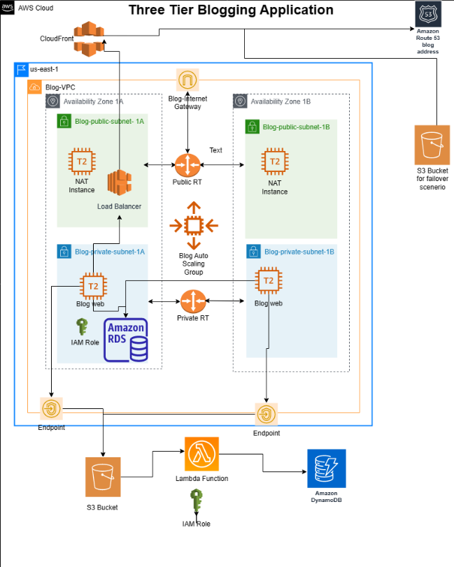
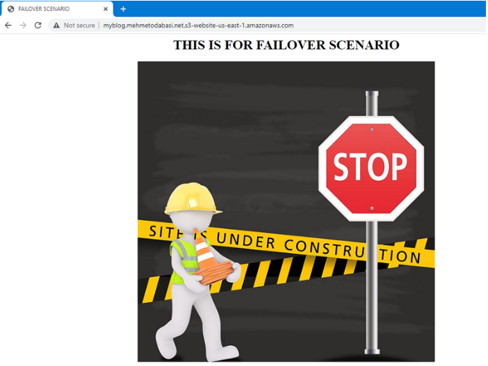
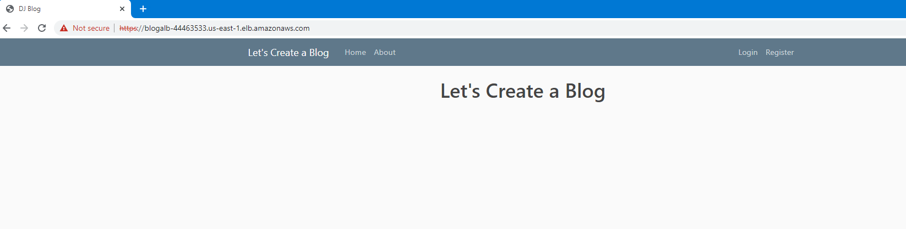

# AWS Three-Tier Blogging Application
A 3-tier architecture is a common way to design web applications, which separates the different components of the application into three layers: presentation, application logic, and data storage. In a typical 3-tier architecture, the presentation layer is responsible for rendering the user interface, the application logic layer processes requests and implements business logic, and the data storage layer manages the application's persistent data.

I recently completed a blogging project and decided to share the methods I used to implement the project. The architecture of the project consists of the presentation tier (S3 and CloudFront), application logic tier (EC2 instances), and data storage tier (MySQL RDS, DynamoDB, and S3). These components are distributed across the public and private subnets within a dedicated VPC, and are designed to be scalable, highly available, and secure.

Here is the diagram of the architecture.



## The architecture

First of all, the main objective of the project is to deploy a blogging application, where people can visit, register, and create posts with images. I was provided with the necessary source code of the blogging app and my job was to implement a three-tier architecture to deploy the application.

The whole architecture is built within a dedicated VPC. In terms of Availability Zones, two of them are utilized with each having both a private and a public subnet.

EC2 instances which will host the blogging application and the MySQL database which will hold the data are placed within private subnets. So, they will not have Internet access directly and will be secure in their locations. 

A NAT instance is placed within the public subnets to help the EC2 instances hosting the blogging application to communicate with the internet, while still remaining isolated from the public internet

An autoscaling group is used for scalability and an application load balancer is used for high availability.

S3 Buckets are used for storing the blog images and also for creating a static website in terms of failover. Route53 is used to create a hosted zone for the blogging application and uses CloudFront deployment as record value which actually uses the application load balancer as origin.

A lambda function is used to trigger any create and delete actions in terms of blog images and a list of those images will be stored in a DynamoDB table.

As I briefly described the architecture, you will have more understanding through the steps that are required to initiate the project.
# Project Steps
## Step 1 Creating VPC

We will start with creating a dedicated VPC.

1.  Open AWS Management Console and enter VPC in the search bar. Then click on VPC to navigate to the VPC Dashboard.
2. Click on "Create VPC". 

3. Choose VPC only option and provide a name "Blog-VPC". Then enter CIDR Block as "10.10.0.0/16" and choose default for tenancy. Tag is optional and hit on Create VPC.
4. In the VPC dashboard, select Blog-VPC, Click Actions, choose Edit VPC settings and enable DNS hostnames

## Step 2 Creating Subnets

We will create subnets for the VPC.

1. While still on VPC service, click on subnets on the left pane.
2. Click create subnet and then create 4 subnets with the following features (Once you enter info for one subnet, click on Add new subnet to open additional fields to enter new subnet information):

Name: Blog-public-subnet-1A VPC: Blog-VPC AZ: us-east-1a CIDR: 10.10.10.0/24

Name: Blog-private-subnet-1A VPC: Blog-VPC AZ: us-east-1a CIDR: 10.10.11.0/24

Name: Blog-public-subnet-1B VPC: Blog-VPC AZ: us-east-1b CIDR: 10.10.20.0/24

Name: Blog-public-subnet-1B VPC: Blog-VPC AZ: us-east-1b CIDR: 10.10.21.0/24

3. One by one, select public subnets. When selected, click on Actions, then Edit Subnet.  Under "auto-assign IP settings" check "Enable auto-assign public IPv4 address".

## Step 3 Creating Internet Gateway

We will create an Internet gateway to establish communication between instances in our VPC and the Internet.

1. While still on VPC service, click on Internet Gateway on the left pane and then click on Create Internet Gateway.

2. Enter Blog-IGW for the name and hit on Create Internet Gateway.
3. You will see a green banner indicating the creation of the Internet Gateway. Click on "Attach to a VPC" on that banner.
Note: If for some reason you are not able to see the banner or you closed it by mistake, then select Internet gateways on the left pane, choose the newly created internet gateway, click on Actions and choose Attach to VPC option.
4. Choose your VPC from the Available VPCs and click on Attach internet gateway.

## Step 4 Creating Route Tables

Route tables control the traffic flow between subnets within the VPC and to and from the internet. A route table contains a set of rules, or routes, that specify how traffic should be directed from one subnet to another, or to an external destination. Therefore, we need to create route tables for the newly created Internet gateway.

1. Select Route Tables from the left pane.

2. You will see two route tables (unless you had created more before). The default route table is attached to the default internet gateway. We will not touch it. What we will do is to manage the other one.

3. Check the line that belongs to Blog-VPC, click on the edit name icon and add "Blog-public-RT" and click on save. When we created the internet gateway, it created a public route table automatically. We just renamed it to keep track of our resources. 

4. By default, Blog-public-RT only has local network enabled. We will modify it to have internet connectivity. Therefore, click on Blog-public-RT and when it opens, click on Edit routes on the right.

5. Click on Add route and enter 0.0.0.0/0 for Destination. Then choose Internet Gateway from the Target dropdown list. You will be presented with the newly created internet gateway, select it and click on save changes.

6. Go back to Route tables menu from the left pane and click on Create Route Table on the right. Then enter Blog-private-RT as name, choose Blog-VPC from the VPC list and click on Create route table to create the private route table.

7. Now we have two route tables (public and private) but we have to associate them with the subnets we created earlier. First, select the Blog-public-RT by clicking on it and then select Subnet associations tab.Check the public subnets from the list and click on Save associations.

8. Go back to Route tables and select Blog-private-RT. Then choose Subnet associations tab. Finally, check the private subnets from the list and click on Save associations.

## Step 5 Creating Endpoint

Endpoints are used to provide secure and private access to AWS services from within a VPC without going over the public internet. We will utilize them for connecting S3 and SDynamoDB. 

1.Select Endpoints from the left pane and then click on Create endpoint on the right.

2. Enter Blog-endpoint for name and choose AWS services for service category.

3. In the services list, write s3 in the filter field and choose Service Name: com.amazonaws.us-east-1.s3 from the list. You will be presented three options. Choose Gateway option.

4. Choose Blog-VPC from VPC list and select the Blog-Private-RT from route tables. Keep the Full Access as Policy and click on Create endpoint.

## Step 6 Creating Security Groups

We will create security groups to control the inbound and outbound traffic to our resources, such as EC2 instances, RDS instances, and load balancers.

1. Select Security Groups from the left pane.

2. Click on Create Security Group

3. Enter Blog_ALB_Sec_Group for name and enter description (optional).Choose Blog-VPC from VPC list. We will not modify outbound connections and keep defaults for them. But for inbound connections click on Add rule and choose HTTP from the Type dropdown menu. Then choose IPv4 anywhere from the Source list and click on Add rule again.

4. Choose HTTPS from the Type dropdown menu and then choose IPv4 anywhere from the Source list and click on Create security group on bottom left.

5. Go back to Security Groups dashboard and click on Create Security Groups again.

6. Enter Blog_NAT_Sec_Group for name and enter description (optional). Choose Blog-VPC from VPC list. We will not modify outbound connections and keep defaults for them. But for inbound connections click on Add rule and add HTTP, HTTPS, and SSH with IPv4 anywhere as the Source just like we created the previous security group. Then click on create security group.

7. Go back to Security Groups dashboard and click on Create Security Groups again.

8. Enter Blog_EC2_Sec_Group for name and enter description (optional). Choose Blog-VPC from VPC list. We will not modify outbound connections and keep defaults for them. But for inbound connections click on Add rule and add HTTP, HTTPS, and SSH. For the SSH, source will be IPv4 anywhere but for HTTP and HTTPS the Source will be the Application Load Balancer security group which we just created earlier. By this way, traffic will come through Application Load Balancer to EC2 instances. To do that, enter ALB in the filter field and once you see Blog_ALB_Sec_Group, choose it for both HTTP and HTTPS.  Then click on create security group.

9. Go back to Security Groups dashboard and click on Create Security Groups again.

10. Enter Blog_RDS_Sec_Group for name and enter description (optional). Choose Blog-VPC from VPC list. We will not modify outbound connections and keep defaults for them. But for inbound connections click on Add rule and add HTTP. We will only open port 3306 and we will use source as EC2 security group so that only connections from the EC2 group will be allowed to connect the RDS. Therefore, choose MySQL/Aurora from the Type dropdown menu and enter EC2 for source filter field. Once you see Blog_EC2_Sec_Group choose it and click on create security group.

## Step 7 Creating RDS

Amazon Relational Database Service is a managed database service provided by AWS and supports many relational database engines, including Amazon Aurora, MySQL, MariaDB, PostgreSQL, Oracle, and Microsoft SQL Server. For the project, I will use RDS MySQL and leave the management to AWS.

1. Go to RDS service

2. First, we should create a subnet group to specify the subnets where our DB instances will reside. Therefore, click on subnet groups from the left pane and then click on Create DB subnet group.

3. Enter Blog_RDS_Subnet_Group for name and a description (optional). Then select Blog-VPC from the VPC list.

4. For high availability, choose the two Availability Zones that we used when creating the VPC. Then select the private subnets from each AZ (RDS will be in private subnets). Finally, click on Create.

5. Now, go back to RDS Dashboard and click on Create Database.

6. Choose Standart Create as database creation method and MySQL as database engine.

7. Scroll down to Engine Version and select 8.0.28 from the Version list. Also choose Free Tier as the template (If you want Multi-AZ deployment, you can opt for Production or Dev/Test).

8. In the Settings section, enter Blog-RDS as DB instance identifier, admin as Master username and Testing1234 as the Password (You can use any username and password but have to modify settings.py for the blog application accordingly).

9. For instance configuration, choose Burstable classes as instance class and db.t2.micro as instance type. In terms of storage, choose 25 GB for allocated storage and enable storage autoscaling with up to 100GB maximum storage threshold.

10. In Connectivity, scroll down to VPC list and choose Blog-VPC. Since we only have one subnet group, blog_rds_subnet_group will be automatically populated in DB subnet group section. If not, choose blog_rds_subnet_group from the list. Also, remove the default security group by clicking on the X button next to it and choose Blog_RDS_Sec_Group from the Existing VPC security groups list. Public access will be No.

11. Make sure that the port is 3306 in additional configuration and password authentication is selected in Database authentication.

12. Scroll down to Additional Configuration under Monitoring section and click on the little arrow to expand it.  Enter mydatabase for Initial Database Name.

13. For maintenance, enable auto minor version upgrade and choose a window for Monday 04:00 UTC. Then click on Create database to create the RDS database.

## Step 8 Creating S3 Buckets

We will create two buckets for the project. The first one will be used to store the images that will be uploaded by bloggers while the second bucket will be used for failover scenario.

1. Go to S3 service and click on Create Bucket.
2. Bucket names must be unique, so enter ENTERYOURNAMEHEREblog as the name. For region, choose N.Virginia and select ACLs enabled and Bucket owner preferred for Object Ownership.
3.  Uncheck Block all public access and acknowledge the warning. Leave the rest to defaults and hit on Create Bucket.
4. Go back to S3 dashboard and click on Create bucket again (At this point, we will create a bucket for Failover scenario but you must have a domain name from Route 53). Enter myblog.YOURDOMAINNAME as name, choose N.Virginia as region, and select ACLs enabled and Bucket owner preferred for Object Ownership.
5.  Uncheck Block all public access and acknowledge the warning. Leave the rest to defaults and hit on Create Bucket.

6. Click on the newly created bucket with your domain name from the list. Then click on Properties tab.
7. Scroll down to the bottom and click on Edit Static website hosting. Choose Enable for Static website hosting and then enter index.html for Index document. Leave the rest to defaults and save changes.
8. Now click on objects tab and click on upload. 

9. Click on add files and choose files for failover scenario (Index.html and under-construction.jpg).
10. Then click on permissions and choose Grant public-read access and check the warning below. Then click on upload.
11. Go back to buckets list and click on this bucket (with your domain name) again. 

12. Click on properties tab and scroll down to the bottom where it says Static website hosting. You will see the link for the static website. Click to open the link.
13. Here is the failover scenario. 



## Step 9 Preparing Repository

Blogging application will work on EC2 instances and EC2 instances will get the source code from a private GitHub repository. In the next steps, we will include the git clone commands in the user data so we will prepare the repository first.

At this step assume that you are provided with the source code. 

1. Create a private repo and commit the source code
2. Modify settings.py under cblog to add RDS endpoint, RDS credential information and S3 bucket name. Make sure that the USER name is the same user name that you entered when creating the RDS database. Also NAME is the name of the database that you entered when creating the RDS database.
3. Note that the password is not hardcoded. We will include password information in a .env file. So modify the .env file to include the password that you entered when creating the database.
4.  Do not forget to commit all the changes.

## Step 10 Preparing User data for Launch Template

Blogging application is built with Django Framework and it requires certain software to be installed on EC2 instances to be able to run flawlessly. Also, we will need git software to be able to clone our repository. Also, we will need to include a GitHub token to access our private repo. At this point I assume that you already have a GitHub token. If not, you can get one from GitHub through Settings-developer settings-Personal access tokens-Tokens.
```bash
#!/bin/bash
apt-get update -y
apt-get install git -y
apt-get install python3 -y
cd /home/ubuntu/
TOKEN="ENTERYOURTOKENHERE"
git clone https://$TOKEN@
cd /home/ubuntu/
apt install python3-pip -y
apt-get install python3.7-dev default-libmysqlclient-dev -y
pip3 install -r requirements.txt
cd /home/ubuntu//src
python3 manage.py collectstatic --noinput
python3 manage.py makemigrations
python3 manage.py migrate
python3 manage.py runserver 0.0.0.0:80
```

## Step 11 Creating a NAT instance

In the architecture, EC2 instances are placed in a private subnet without Internet access. We will use a NAT instance to grant EC2 instances Internet access.

1. Go to EC2 service and click on launch instance.
2. Enter Blog NAT Instance as name and then scroll down to Amazon Machine Images.  Click on Browse More AMIs and then enter "nat" in the search bar and hit enter. You have the below screen with four tabs. Choose Community AMIs and from the community AMIs, select the first one (amzn-ami-vpc-nat-2018.03.0.20221018.0-x86_64-ebs).
3. You will be back at the EC2 launch screen. Choose t2.micro as the instance type, and your own keypair.
4. Scroll down to Network settings and click on edit on the right. Then from the VPC list choose Blog-VPC and from subnets select Blog-public-subnet-1A (any of your public subnets). In terms of security groups, choose existing and then select Blog_NAT_Sec_Group from the list.  
5. When finished click on launch instance.

6. Go back to EC2 dashboard to see all instances and select the newly created NAT instance. Then click on Actions-Networking-Change source/destination check. When opened, put a tick mark next to Stop and then save.

7. Now that we have the NAT instance running, we should add it as target for private route tables so that the instances on private subnet can use this instance to connect to Internet. Go to VPC service again and click on Route Tables from left pane. Select Blog-private-RT and click on routes tab. Then click on edit routes.

8. Select Blog-private-RT and click on routes tab. Hit on edit routes and then click on add route. For destination enter 0.0.0.0/0 then for target choose instance. Once NAT instance is shown select it and save changes.

## Step 12 Creating IAM role for Launch Template

Blogging application will run on EC2 instances and when users upload pictures they will be saved in a S3 bucket. Therefore, EC2 instances will need access to S3 buckets. We will achieve this by using an IAM role.

1. Go to  Identity and Access Management service.

2. Click on Roles from left pane and then click on Create role on the right.

3.  Choose AWS as Trusted entity and EC2 as use case and then click on next.
4.  Enter S3 in search bar and hit enter. Once the list is populated, choose AmazonS3FullAccess and hit on next.

5. Enter Blog_EC2_S3_Full_Access for name and provide a description (optional). Then click on create role on bottom right.

## Step 13 Creating Launch Template

1. Go to EC2 service, click on Launch templates from left pane and then click on Create launch template on the right.

2. Enter Blog_launch_template for name and Blog Web Page version 1 for description.

3. Scroll down to Application and OS Images and hit on quick start. Then click on ubuntu and choose Ubuntu 18.04 from the list.

4. Choose t2.micro for instance type and select your own key pair. In terms of security groups, choose existing security groups and select Blog_EC2_sec_group from the list.

5. Scroll down to Advance Details and hit on it to expand. Click on the little arrow for the IAM instance profile section and select the Blog_EC2_S3_Full_Access role we just created.

6. Scroll down to User data section and paste the user data that we prepared earlier. Then click on create.

## Step 13 Creating Application Load Balancer and Target Group

Application load balancer will distribute the incoming traffic for our blog application to EC2 instances to balance their workload.

1. While still on EC2 service, select Load Balancers from the left pane and hit on Create load balancer. 

2. We will use an application load balancer so click on create under Application Load Balancer.

3. Enter BlogALB as the name. Scheme will be Internet-facing and IP address type will be IPv4.

4. Under Network mappings, choose Blog-VPC from the VPC list and then choose the two AZs we used in our VPC. When subnets lists are populated, select the public ones for each AZ.

5. Choose existing security groups and select Blog-VPC_ALB_Sec_group

6. Under Listeners and Routing, we will enter Protocol Type and port as well as target information. However, we have not created a target yet. So click on Create target group to handle target creation process.

7. A new browser windows opens for target creation menu. Select Instances as target type and enter BlogTargetGroup for name.

8. Since we selected Blog-VPC in load balancer menu, VPC is automatically populated as Blog-VPC, and the protocol is HTTP with port 80. Protocol version is HTTP1. Leave health check protocol as HTTP and the path as / and then click on Advanced health check settings.

9. We can specify healthy threshold values here as we desire. However, I will keep the defaults because they work for me. You can change any of the values here and they are self-explanatory. Basically, what they do is to continuously check the EC2 instances and determine whether they are working healthily. Click next to continue.

10. Normally on this page we can register existing EC2 instances as targets. However, we will not do that. We will use autoscaling to create EC2 instances from the launch template we created earlier and in that process, we will attach this target group with the load balancer to our EC2 instances. So just click on Create Target Group to finish creating the target group.

11. Now go back to the previous browser screen where we we were in the process of creating the load balancer. Click on the refresh icon first and then select the BlogTargetGroup we just created as Forward to target.

12. Click on Add listener. Enter HTTPS for Protocol and 443 for Port and then select BlogTargetGroup as Forward to target. Since this is a secure listener, scroll down and select your certificate from ACM (assuming that you have created a certificate for your domain name). Then click on Create load balancer.

13. Click on View load balancer to go to the load balancers list. Here, we will modify the listeners so that the load balancer will always redirect HTTP requests to secure HTTPS. Therefore, select BlogALB and click on Listeners tab. Then check HTTP 80, click on Actions and hit on Edit Listener.

14. In the Listener details part, click on Remove.

15. Then under default actions add a rule to Redirect. Choose HTTPS for protocol, enter 443 for Port and save changes.

## Step 14 Creating Auto Scaling Group

We want our blogging application to be highly scalable, so we will create an autoscaling group. If we have increasing traffic in the future, this ASG will increase the number of EC2 instances running our blogging application to scale up to mee the needs. 

1. While still on EC2 service, select Auto Scaling Groups on the left pane and click on Create Auto Scaling Group on the right.

2. Enter Blog_ASC for name and choose the launch template that we created earlier and then click next.

Note: If you modify your launch template and save it again it will be in a different version. In that case, be sure to note that version and select it here in the Version field. Otherwise, it will be the default 1st version.

3. Select Blog-VPC from the VPC list and then select the two private subnets we created with VPC. EC2 instances will be in private subnets and reach out to Internet through the NAT instance we created earlier. When finished, click next to continue.
4. At this step, we will attach the ASG to the load balancer we created in Step 13. Choose Attach to an existing load balancer option and then select the BlogTargetGroup from the target groups list. Also choose ELB for health checks and hit on next.
5. Here we will define the group size of the EC2 instances. The ASG will try to match the desired capacity (2) with going down to minimum (1) and without exceeding the maximum (4) size depending on the necessity. The necessity level we set here is the CPU Utilization Average. If it exceeds 70%, ASG will spin up new EC2 instances to scale up the compute resources. When finished, click on next.
6. At this step, we can setup a SNS notification to warn us whenever a change is made in the ASG. It is an optional step so I will skip this step and jump to review page. However, you can set up a notification by clicking on Add notification and following the instructions should you desire. Otherwise, click on skip to review and then click on create Auto Scaling Group.

7. Now go back to EC2 dashboard to see the EC2 instances initiating by the ASG. It will take some time for them to boot up and start because of the user data we added to the launch template. But, as soon as the status check becomes 2/2 checks passed, we can check the blogging application through the load balancer.

8. Click on Load balancers from the left pane and then select BlogALB. Then from the details page, copy the DNS Name and paste it to your browser.

9. You will face a privacy warning. Just ignore it and click on Advanced. You may have a different warning depending on the type of your browser. Shown in the picture below is Chrome browser. After that click on proceed to DNS address.

10. There we go! We have the blogging application up and running



## Step 15 Creating CloudFront Distribution

Amazon CloudFront is a content delivery network (CDN) that speeds up the distribution of static and dynamic web content, such as HTML, CSS, JavaScript, images, and videos, to end-users worldwide. CloudFront integrates with other AWS services, including Amazon S3, EC2, Elastic Load Balancing, and Lambda@Edge. Here we will integrate it with our application load balancer.

1. Go to CloudFront service and click on create a CloudFront distribution

2.  For Origin Domain, choose BlogALB from Elastic load balancer (Not S3), for Protocol choose Match viewer with HTTP=80 and HTTPS=443 and leave the origin path blank which is actually defining the root as /.

3.  Scroll down until the Viewer part by leaving the values to defaults and then in Viewers part choose Redirect HTTP to HTTPS. Then for allowed HTTP Methods, choose the one with all the options (GET, HEAD, OPTIONS, PUT, POST, PATCH, DELETE) and check OPTIONS under Cache HTTP methods. Also do not restrict viewer access.