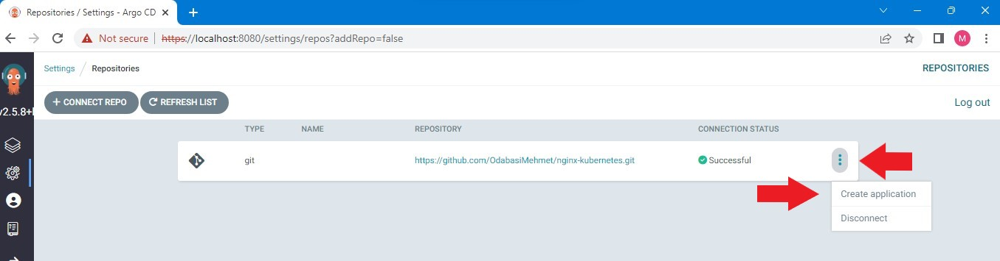
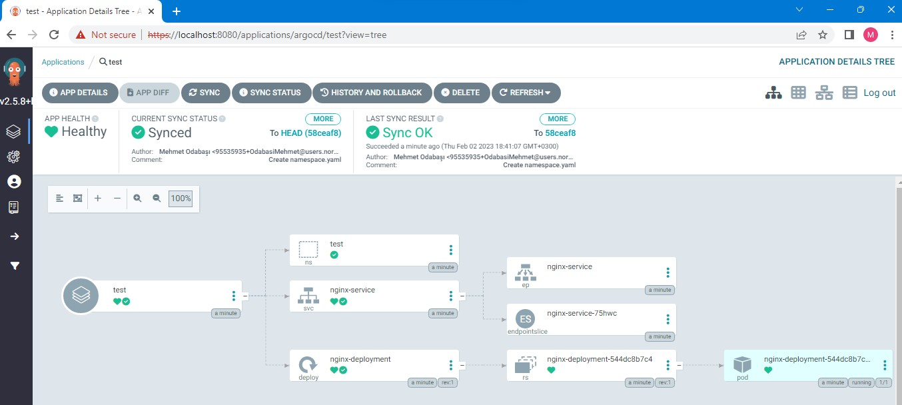

# Installing Argocd on Minikube and deploying a sample application

Argo CD is a tool that helps developers easily manage and deploy their applications on a Kubernetes cluster. It works by constantly comparing the desired state of the application, as defined in a Git repository, with the current state of the cluster. It automatically makes any necessary updates and can roll back changes if needed. It also has a user-friendly web interface and a command-line interface for managing deployments.

Minikube is a tool that allows you to run a Kubernetes cluster on a single machine, which can be useful for testing and development purposes. (It's important to notice that Minikube is just a tool for local development and testing, not for production environment) 

You can use Minikube to run Argo CD. To use Argo CD with Minikube, you would first need to install and start Minikube, and then install Argo CD on the Minikube cluster. Once Argo CD is running, you can use it to deploy and manage applications on the Minikube cluster in the same way as you would with a production cluster.

In this story, I will demonstrate how to install argocd on minikube and deploy a sample application.

# Prerequisite

You need to have minikube installed 

# Installing argocd on minikube

1. We will start with launching minikube. There are several driver options that you can use to start a minikube cluster (virtualbox, docker, hyperv). I used docker as driver. 

```bash
minikube start --driver=docker
```


2. As many kubernetes tools, argocd requires a namespace with its name. Therefore, we will create a namespace for argocd.

```bash
kubectl create ns argocd
```
3. We will apply argocd manifest installation file from argocd github repository

```bash
kubectl apply -n argocd -f https://raw.githubusercontent.com/argoproj/argo-cd/v2.5.8/manifests/install.yaml
```


4. Let's verify the installation
 by getting all the objects in the argocd namespace.
```bash
kubectl get all -n argocd
```


You should see all the resources created with the installation. Some resources may need some time to be in a running state but having them there means that we are good to go.

5. Argocd has a nice user interface for management. In order to access the web GUI of ArgoCD, we need to do a port forwarding. For that we will use the argocd-server service (But make sure that pods are in a running state before running this command).

```bash
kubectl port-forward svc/argocd-server -n argocd 8080:443
```


6. Now we can go to a browser and open localhost:8080


You will see a privacy warning. Just ignore the warning, click on Advanced and then hit on `Proceed to localhost (unsafe)` to continue to the GUI interface. (Your browser setting may present a different option to continue).


7. To use argocd interface, we need to enter our credentials. The default username is `admin` so we can enter it immediately, but we will need to get the initial password from argocd through minikube terminal.Initial password is kept as a secret in the argocd namespace; therefore, we will use jsonpath query to retrieve the secret from the argocd namespace. We also need to decode it with base64. To do the both operations, just open a new terminal and enter the following code to do the trick for you. (Do not close the first terminal window as the port-forwarding is still alive)

```bash
kubectl -n argocd get secret argocd-initial-admin-secret -o jsonpath="{.data.password}" | base64 -d; echo
```
8. Copy the password, go back to your browser and enter it as password (username is admin). You should be in the GUI interface.


9. Now that we are in the userface, we can create a new app. The source code for my application is in my Github repo, so I will connect my Github repo to ArgoCD. (We could also hit `new app` and add our repo there, but I opted for this option first)

Click on the gear icon to open settings


Click on repositories


Click on connect repo


For connection method, choose HTTPS
Choose default for Project
Enter your github repo as repository URL 
Fnally, hit on connect


You should get a `Successful` message in terms of connection status.

10. Let's create a new app from the repo

At the far right of the `Successful` message, click on the three dots. The pop up menu will have a `create application`option. Also click that option.



Enter test as application name
Choose default for Project Name
Choose Automatic for Sync Policy


Enter repository URL (You do not have to type it down, it is already there)
Enter nginx as path (My resource files are in ngix directory of my repo)
Choose kubernetes.default.svc as cluster URL
Enter test as namespace (I already have a namespace object with test)
Hit on Create on the top


There we go! We have our app!


11. Click anywhere on the app to get detailed view of the application.



