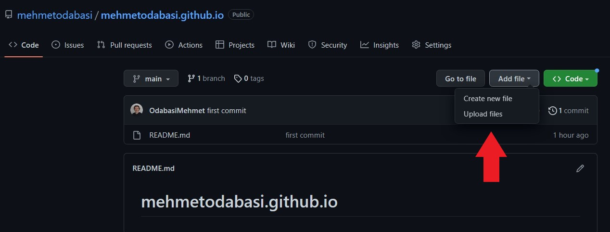

GitHub is a web-based Git repository manager and version control system. I have been using GitHub for over a year and I wanted to share a feature of Github that I find extremely useful.
Github offers a special repository for each user to host a static website. This service is called Github Pages and it is designed to host your personal, organization, or project pages from a GitHub repository. 
Normally, when you create a repo for Github pages, you will have a website that has an URL in the form of `username.github.io`. However, you can also use custom domain names for your GitHub Pages. In this story, I will guide you through adding a custom domain name for your Github Page.

# Creating a webpage on Github Pages

1. Log into your Github account and hit create repo

2. For the repository name, enter your Github username followed buy github.io. This is the way Github Pages work. The format is `username.github.io`. If you choose a different name as the repo name, such as `devopsguide.io` Github will add that name as a path to your username, like `username.github.io/devopsguide.io`. So, stick with the username.

3. Choose Public, click on Add a README file option and hit create repository. You will be presented with a quick setup page.

4. Now, you need to build your website. You have two options
- You can clone your repository to your local and work on creating your static webpage by adding content (You do not have to be a Frontend developer, you can use basic css+html or you can use free templates)
- OR
- If you already have content, you can upload those to your repo.

5. I already have the content, so I will just upload files to my github repo

6. Once you upload your files, you need to commit changes.

7. Now go to the settings 

8. Click on Pages from the menu on the left.

9. You can see that your site is alive at your address. Just click on the address to access to your website.

10. There we go. Now we have our website live on Github Pages.

# Registering our own custom domain name

Prerequisite: You need to register a domain name for yourself before moving to this section. I registered a domain name through AWS Route 53 so this tutorial will be based on Route 53. However, the methodology is the same. You can apply to what you will see in Route 53 to your domain service.

1. Go to your repository again and click on settings as we did in step 7 and click on Github Pages as we did on step 8.

2. You will see a section titled `Custom domain`. Enter your domain name, put a tick on Enforce HTTPS and click on save. Then click on `Learn more` link which is at the end of the sentence under Custom Domain title (See the red arrow in the pic below).

3. Click on `Managing a custom domain for your Github Pages site`

4. Scroll down the page until you see four IP addresses for Github Pages. These IP addresses. We will need these IP addresses to create an A record on our domain provider to point our apex domain to the IP addresses for GitHub Pages. Copy those IP addresses

5. Now head to your Domain Service. I will log into AWS Console and open Route53. 
6. Click on Hosted Zones to find your domain name and click on your domain name.

7. Now click on `Create record`.

8. The record type is A record by default and we will keep it. If it does not come as A record by default, choose A record. Then enter the 4 IP addresses we copied from Github and click create records. Note that, you should create a record for your domain name without any subdomains first and then with `www`as subdomain. So we will end up adding two records. We will use the same 4 IP addresses for both records.

9. We will have to wait a little while for the changes to take affect. Then voila!

Note that I also have a certificate that I obtained from AWS Certificate Manager for secure connectivity.

