# Installing Kubernetes on Ubuntu 20.04 running on AWS EC2 Instances and deploying an Nginx server on Kubernetes

In this tutorial, I will guide you through installing Kubernetes on Ubuntu instances on AWS and then demonstrate how to deploy a simple Nginx server on Kubernetes.

In order to do this, we will spin up two Ubuntu instances from the AWS Console. One of them will be configured as the Master node, while the other will be the worker node. 
When configuring the instances, we should choose at least `2 CPU Core` and `2GB RAM` at minimum to get the system working efficiently. In terms of instance type,`t2.medium` does the job so we will use it to satisfy the minimum infrastructure requirement.

# Part 1 Configure Security Groups

Before spinning up the instances, we must configure two security groups to go with the instances. The Kubernetes documentation requires specific ports to be open for the Kubernetes to run smoothly. You can check the documentation from here (https://kubernetes.io/docs/reference/ports-and-protocols/)


### Ports for the Control-plane (Master) Node(s)

1. TCP   6443       --> For Kubernetes API server
2. TCP   2379-2380  --> For etcd server client API
3. TCP   10250      --> For Kubelet API
4. TCP   10259      --> For kube-scheduler
5. TCP   10257      --> For kube-controller-manager
6. TCP   22         --> For remote access with ssh
7. UDP   8472       --> Cluster-Wide Network Comm. - Flannel VXLAN

### Worker Node(s)

1. TCP   10250      --> For Kubelet API
2. TCP   30000-32767-->	NodePort Services†
3. TCP   22         --> For remote access with ssh
4. UDP   8472       --> Cluster-Wide Network Comm. - Flannel VXLAN

## Create Security Group for Master

1. Go to the AWS Console, EC2 Service and choose Security Group from the left hand bar menu.

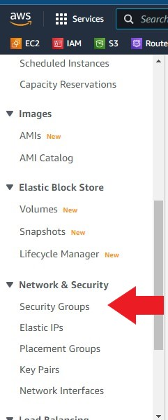

2. Click on create security group, name it `K8-Master-SG`and then click on `add inbound rule` to enter the ports described above. When you are done just click on create security group on the lower left of the page to finish the process.

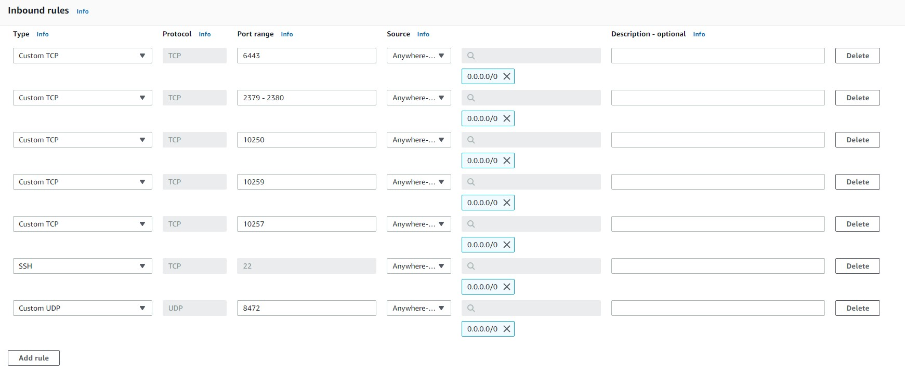

3. Choose Security Group from the left hand bar menu one more time for the worker security group.

4. Click on create security group, name it `K8-Worker-SG`and then click on `add inbound rule` to enter the ports described above. When you are done just click on create security group on the lower left of the page to finish the process.


4. Repeat the steps above to create the worker instance. Keep the same configuration and just name it `kube-worker-1`and choose the `K8-Worker-SG` security group.

5. Wait for the instances to boot up. Then ssh into both of them.

```bash
ssh -i "yourkey.pem" ubuntu@xxx.xxx.xx.xx ## (Replace x with your instance's public IP address)
```

# Part 3 Working with instances

1. First of all, we should change the hostnames of the instances so that we should know which one is master and which one is the worker. let's start with the master node.

```bash
sudo hostnamectl set-hostname master
bash
```

2. Then write `bash`and hit enter to see the new hostname.

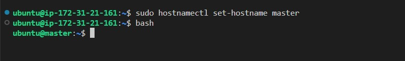

3. Before installing Kubernetes packages, we should update the system.

```bash
sudo apt-get update
```

4. Now, we can install helper packages for Kubernetes.

```bash
sudo apt-get install -y apt-transport-https gnupg2
```

5. Continue installing the helper packages

```bash
curl -s https://packages.cloud.google.com/apt/doc/apt-key.gpg | sudo apt-key add -

echo "deb https://apt.kubernetes.io/ kubernetes-xenial main" | sudo tee -a /etc/apt/sources.list.d/kubernetes.list
```
6. We need to update the system again after we are done with the helper packages.


```bash
sudo apt-get update

```
7. Continue with the Kubernetes installation

```bash
sudo apt-get install -y kubectl kubeadm kubelet kubernetes-cni docker.io
```

8. Now we have to start and enable Docker service.

```bash
sudo systemctl start docker
sudo systemctl enable docker
```

9. For the Docker group to work smoothly without using sudo command, we should add the current user to the `Docker group`.

```bash
sudo usermod -aG docker $USER
```

10. Now we run the following command so that the changes take affect immediately.

```bash
newgrp docker
```

11. As a requirement, update the `iptables` of Linux Nodes to enable them to see bridged traffic correctly. Thus, you should ensure `net.bridge.bridge-nf-call-iptables` is set to `1` in your `sysctl` config and activate `iptables` immediately.

```bash
cat << EOF | sudo tee /etc/sysctl.d/k8s.conf
net.bridge.bridge-nf-call-ip6tables = 1
net.bridge.bridge-nf-call-iptables = 1
EOF
sudo sysctl --system
```

We are done with the initial configuration of the master node. Now we will repeat all 10 steps for the worker node. The only difference would be the name of the node.

1. Change the terminal to the worker node instance and change the host name

```bash
sudo hostnamectl set-hostname worker
```

2. 2. Then write `bash`and hit enter to see the new hostname.

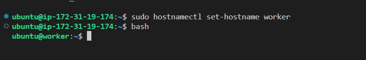

3. Before installing Kubernetes packages, we should update the system.

```bash
sudo apt-get update
```

4. Now, we can install helper packages for Kubernetes.

```bash
sudo apt-get install -y apt-transport-https gnupg2
```

5. Continue installing the helper packages

```bash
curl -s https://packages.cloud.google.com/apt/doc/apt-key.gpg | sudo apt-key add -
```
```bash

echo "deb https://apt.kubernetes.io/ kubernetes-xenial main" | sudo tee -a /etc/apt/sources.list.d/kubernetes.list
```
6. We need to update the system again after we are done with the helper packages.


```bash
sudo apt-get update

```
7. Continue with the Kubernetes installation

```bash
sudo apt-get install -y kubectl kubeadm kubelet kubernetes-cni docker.io
```

8. Now we have to start and enable Docker service.

```bash
sudo systemctl start docker
sudo systemctl enable docker
```

9. For the Docker group to work smoothly without using sudo command, we should add the current user to the `Docker group`.

```bash
sudo usermod -aG docker $USER
```

10. Now we run the following command so that the changes take affect immediately.

```bash
newgrp docker
```

11. As a requirement, update the `iptables` of Linux Nodes to enable them to see bridged traffic correctly. Thus, you should ensure `net.bridge.bridge-nf-call-iptables` is set to `1` in your `sysctl` config and activate `iptables` immediately.

```bash
cat << EOF | sudo tee /etc/sysctl.d/k8s.conf
net.bridge.bridge-nf-call-ip6tables = 1
net.bridge.bridge-nf-call-iptables = 1
EOF
sudo sysctl --system
```


## Part 4 - Setting Up Master Node for Kubernetes

In this part, we will execute commands of on Master Node only.

1. We will pull the packages for Kubernetes beforehand

```bash
sudo kubeadm config images pull
```
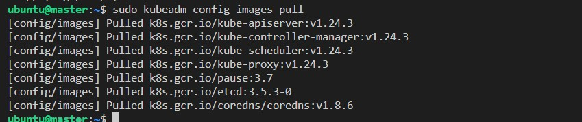

2. By default, the Kubernetes cgroup driver is set to system, but docker is set to systemd. We need to change the Docker cgroup driver by creating a configuration file `/etc/docker/daemon.json` and adding the following line then restart deamon, docker and kubelet:

```bash
echo '{"exec-opts": ["native.cgroupdriver=systemd"]}' | sudo tee /etc/docker/daemon.json
```
```bash
sudo systemctl daemon-reload
```
```bash
sudo systemctl restart docker
```
```bash
sudo systemctl restart kubelet
```

3. At this stage, the `kubeadm` will prepare the environment for us. For this we need the private IP of the master node.

```bash
sudo kubeadm init --apiserver-advertise-address=172.31.21.161 --pod-network-cidr=10.244.0.0/16 # Use your master node's private IP
```

4. If you did everything correctly, you should see the following screen.

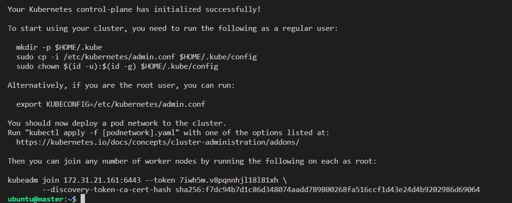


5. At this point note down the last part of the output that includes the `kubeadm join `:

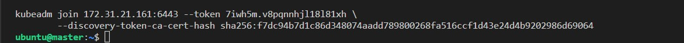

6. Now, we need to run the following commands to set up local `kubeconfig` on master node.

```bash
mkdir -p $HOME/.kube
```
```bash
sudo cp -i /etc/kubernetes/admin.conf $HOME/.kube/config
```
```bash
sudo chown $(id -u):$(id -g) $HOME/.kube/config
```

7. Activate the `Flannel` pod networking.

```bash
kubectl apply -f https://github.com/coreos/flannel/raw/master/Documentation/kube-flannel.yml
```
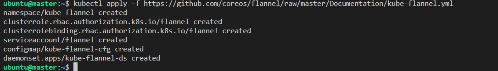


8. Finally check to see that the Master node is ready

```bash
kubectl get nodes
```
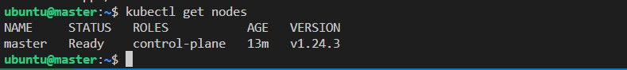


## Part 5 - Adding the Worker Node to the Cluster

In the previous part, we configured the master node. Therefore, when we ran the `kubectl get nodes `command, we could only see the master nod as ready.In this part, we will add the worker node to the cluster.

1. By default, the Kubernetes cgroup driver is set to system, but docker is set to systemd. We need to change the Docker cgroup driver by creating a configuration file `/etc/docker/daemon.json` and adding the following line then restart deamon, docker and kubelet:

2. Ensure that you run the following commands on the worker node.

```bash
echo '{"exec-opts": ["native.cgroupdriver=systemd"]}' | sudo tee /etc/docker/daemon.json
```
```bash
sudo systemctl daemon-reload
```
```bash
sudo systemctl restart docker
```
```bash
sudo systemctl restart kubelet
```

3. Remember that we noted `sudo kubeadm join...` command previously. We will now run that command to have them join the cluster. Do not forget to add `sudo` before the command.

```bash
sudo kubeadm join 172.31.21.161:6443 --token 7iwh5m.v8pqnnhjl18l81xh --discovery-token-ca-cert-hash sha256:f7dc94b7d1c86d348074aadd789800268fa516ccf1d43e24d4b9202986d69064 
```

Congratulations, we are all set.

Now let's go to the master node and get the list of nodes. If we did everything correctly, then we should see the new worker node in the list.

```bash
kubectl get nodes
```
We can also get a detailed version of the nodes.

```bash
kubectl get nodes -o wide
```

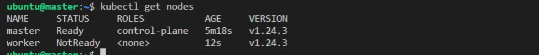

## Part 6 - Deploying a Simple Nginx Server on Kubernetes

We have created our Kubernetes cluster with two nodes. Now, we will deploy a simple Nginex server and check that it works.

1. Let's create and run a simple `Nginx` Server image.

```bash
kubectl run nginx-server --image=nginx  --port=80
```
We should get a `pod/nginx-server created`message as output.

2. Let's check the list of pods to see that Nginx is added to the list.

```bash
kubectl get pods -o wide
```
3. Expose the nginx-server pod as a new Kubernetes service on master.

```bash
kubectl expose pod nginx-server --port=80 --type=NodePort
```
We should get a `service/nginx-server exposed`message as output.

- Get the list of services and show the newly created service of `nginx-server`

```bash
kubectl get service -o wide
```
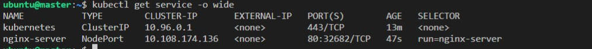

4. From the output, we clearly see that the Nginx server can be reached from the 80:32682 port.
- You will get an output like this. (Your port number will be different so check yours)

5.  Now, let's check whether we correctly deployed Nginx. So open a browser of your choice. Enter the public IP address of your worker instance followed by a `:` and the Nodeport number which in my case is 32682.

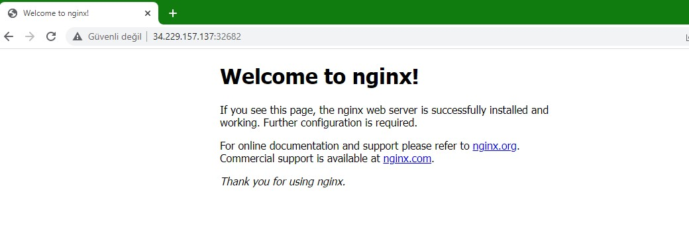

Congratulations! We have correctly started Nginx!


## Part 7 Clean Up

1. Let's start cleaning up with the Nginx


```bash
kubectl delete service nginx-server
kubectl delete pods nginx-server
```
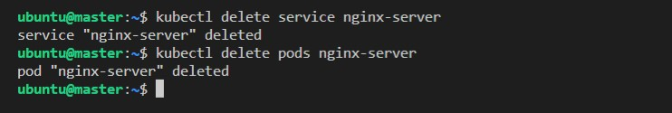

2. Let's delete the worker node by entering the following commands on the Master node. But first we need to check the name of the worker node by entering the `kubectl get nodes`command. 

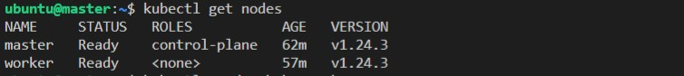

As you can see my worker node is named `worker`. So I will use `worker`in the following commands.

```bash
kubectl cordon worker 
kubectl drain worker --ignore-daemonsets --delete-emptydir-data
kubectl delete node worker
```
3. Now let's go to the worker node and reset it. Note that you will have to confirm with a `y`.

```bash
sudo kubeadm reset
```
  
4. Normally, we did not have to do the first three commands because we are going to terminate the instances and everything will be gone. However, I did so to see how we can delete servcies and reset nodes if were to keep the instances.

5. Now, go to the AWS console and terminate both the master and the worker instances.
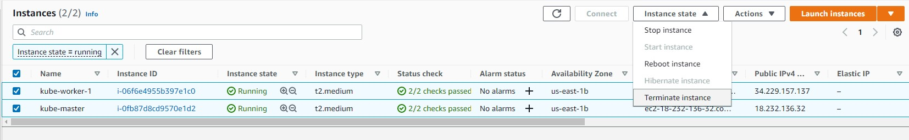

# References

- https://kubernetes.io/docs/setup/production-environment/tools/kubeadm/install-kubeadm/

- https://kubernetes.io/docs/concepts/cluster-administration/addons/

- https://kubernetes.io/docs/reference/

- https://kubernetes.io/docs/reference/generated/kubectl/kubectl-commands#-strong-getting-started-strong-
