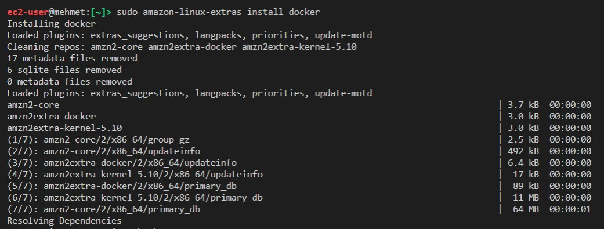
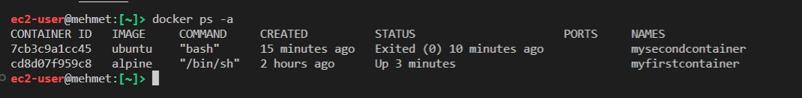

# How to Install Docker on EC2 and create a container

Docker is an open source platform that automates the deployment of applications by containarization. Instead of using an EC2 instance per application or a several virtual machines for each application, Docker offers minimal resource use by the help of containers in which applications can run in an isolated state as long as we desire. In this way, we can deploy multiple applications, in multiple containers in a EC2 instead of just one application per EC2.

In this tutorial, I will guide you through the installation of Docker in an EC2 instance and help you create your very first docker container.

## Prerequisite

A running EC2 instance 
Ssh connection into the instance

## Part 1 Docker installation

1. Update the Linux system

```bash
sudo yum update -y 
```

2. Install the most recent Docker Community Edition package

```bash
sudo amazon-linux-extras install docker
```



3. When prompted enter `y` to continue

4. You will see a list of dependencies installed.


5. Now that we have installed Docker, let's start it.

```bash
sudo service docker start
```

Note: You can also use the following system control command. 

```bash
sudo systemctl start docker
```

6. Let's check if the Docker is actaully up and running.

```bash
sudo service docker status
```


7. By default Docker works with the root user and other users can only access to Docker with sudo commands. However, we can bypass the sudo commands by creating a new group with the name docker and add ec2_user.

First let's create the docker group

```bash
sudo groupadd docker
```

8. Now let's add ec2-user to docker group

```bash
sudo usermod -a -G docker ec2-user
```

8. In order to enable the changes, run the following command

```bash
newgrp docker
```

9. We are all set. Before moving to the next part you can check the docker version.

```bash
docker --version
```


10. If you want to see an extended version of the version details, such as the API version, Go version, and Engine Version, use the version command without dashes.

```bash
docker version
```


## Part 2 Creating a Container

Creating a docker container can be done in two ways. First, you can create a container without starting it. You will need to enter some commands to make it run later on.
The second way is to create and start the container with a single command. I will demonstrate both ways.

### Creating a container without starting it.

1. To create a container you can enter docker container create or docker create command.This command creates a container but does not start it. 
 

```bash
docker create [OPTIONS] IMAGE [COMMAND] [ARG...]
```

2. Let's demonstrate it with an example. I will create a container, have it in the interactive mode with option `-i`, and make sure to allocate tty driver with option `-t`. I will name it ,  `myfirstcontainer` with the `--name`option, and I will use an `alpine` image as a base for my container. (Note that you will need a base image for creating a docker container)

```bash
docker container create -i -t --name myfirstcontainer alpine
```

3. Docker first checked my local to see if I had pulled Alpine image before. Since it could not find, it pulled the image from Docker Hub and installed on my local.


4. In order to check current working containers, we use the `docker ps` command. Let's do that.

```bash
docker ps
```
5. As you can see we do not have any running containers, because we only created the containe but we did not start it yet.


6. If you want to see all containers (running or stopped), you can do so with the following command.

```bash
docker ps -a
```


7. As you see we have the `myfirstcontainer`but the status says only created. Let^s start it.

```
docker container start --attach -i myfirstcontainer
```
8. This command will start the container and you will see an indented # sign which is actually the container terminal. Let's write a simple command
```bash
echo "Hello World !"
```


9. Congratulations you have created your first container. Now you can stop the container by typing `exit`.
Then run the `docker ps`and `docker ps -a `commands. Since we stopped the container by exiting, docker ps command will not return any containers. Docker ps -a , on the other hand will return all containers.


### Creating a container and starting it.

1. We are going to create a second container, name it mysecondcontainer and as the previous example, we will run it in interactive mode.

```bash
docker run -i -t --name mysecondcontainer ubuntu
```

2. As you can see, Docker first checked for the Ubuntu image locally, could not find it, so pulled from Docker Hub. Also note that the `#`sign came immediately after we run the code which means that we are in the container terminal.


3. Now exit the container and return to the ec2 terminal
```bash
exit
```

4. Check the system for the current container

```bash
docker ps -a
```

5. As you can see ,we now have two containers. The firstcontainer is based on an alpine image and the second container is based on an ubuntu image.


### Starting a container

Now that we have two containers which are in stopped mode, we can easily start any of them. For this you will need either the `Container id`or the `Name`of the container.

1. The container that we created based on the alpine image has a container id of cd8d07f959c8 and a name of myfirstcontainer. Let's use the container id as an example and start the alpine container.

```bash
docker start cd8 # You need to enter your container id here
```

2. Note that I did not have to write down the full id number. Unless you have multiple containers starting with the same numbers or letters, a few characters will do the job.


3. Now run the ps -a command to see the containers.



4. Check the status of each container. As you can see the alpine instance which we started shows as `up` while the other container shows `exited`.

5. We have started the container but we did not go into it. We are still at the Ec2 terminal. We can go into the container with the attach command and this time let's use the container name.

```bash
docker attach mysecondcontainer # You need to enter your container name here
```


6. Important: You cannot attach to a stopped container. If you want to attach, you first need to start the container.

### Cleaning Up

We created two containers using two different methods. Now we can delete those containers, since we are done with them in terms of understanding the creation process.

```bash
docker rm myfirstcontainer mysecondcontainer # We can remove more than one container with a single rm command
```

