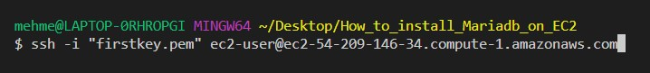

There are many database engines to choose from when it comes to using database engines on the cloud. 
If you are an AWS user, than you can choose  from Amazon RDS, Amazon Aurora, Amazon DynamoDB and many other services.

However, you are not limited to using these services when it comes to databases.You can also launch an EC2 instance
and install MariaDb server on your EC2 instance and make it a MariaDb server.

Below, you can find step by step instructions on how to install MariaDB server on an EC2 isntance.

# PART 1 Launch EC2 Instance.

1. Log in to AWS Console,open EC2 service, and click on launch instance.

(If you want to see detailed information on how to launch an EC2 instance click this link to
"How to create an EC2 instance on AWS") https://medium.com/@mehmetodabashi/how-to-create-an-ec2-instance-on-aws-9f61a442d7f8

2. Name your instance `MariaDbserver` and choose Amazon Linux 2 AMI which is free tier eligible.


3.  Choose t.2 micro as instance type which is also Free tier eligible. Also choose your keypair.


4. In the next part, we will need to create a security group which would allow traffic from both ssh port (22) and Mysql/Aurora port (3306). In order to do that we need to modify the network settings. So, click on edit on the right side of the network settings.


5. Name your security group and click on add security group rule to add inbound rules.


6. From the Type list, choose ssh and make it accessible from anywhere by choosing anywhere option from Source Type. Then, click on add security group rule again and chose MySQL/Aurora from Type list and choose anywhere from Source Type.


7. Finally, click on Launch instance to finish.


# PART 2 Installing MariaDb on EC2 instance

Now that you have an EC2 running, you can install MariaDb on your EC2. In order to do that, you have to open a terminal of your choice and connect to your EC2 instance via SSH connection. Follow the instructions below to connect to your EC2 instance via SSH and then install MariaDb.

1. Open a terminal and use cd (change directory) command to go to the directory which stores your .pem file (You will need your private key to access to your EC2 and your private key is stored as a .pem file)

2. Go to the AWS console EC2 service and click on instances to see your newly created EC2 instance.

3. First, choose your instance by placing a tick ✓ in front of your EC2 name. Then click on connect.


4.  Choose the SSH Client tab and than click on the copy icon under Example to copy the connect command. (You can also select and copy the entire command that starts with "ssh -i " under Example.)

5. Go back to the terminal and paste the ssh -i command that you just copied from the console and hit enter.



6. You will be promted to enter yes and then hit enter again. If you see the following EC2 image then you have successfully connected to your ec2.


7. First, things first. Whenever you connect to a new ec2, you should update it first. 

```bash
sudo yum update -y
```
Once the update is complete you will see the "Complete" message.


8. Now , it is time to install MariaDb server.
```bash
sudo yum install mariadb-server -y
```


9. After the installation, you will need to start the server.

```bash
sudo systemctl start mariadb
```
10. Now, let's check if it it really started working. (active-running means it is working)

```bash
sudo systemctl status mariadb
```


11. Finally, let's make sure that it will keep working even after we restart ec2.

```bash
sudo systemctl enable mariadb
```

# PART 3 Connecting to MariaDb Database on EC2 instance

In the first part, we launched an ec2 instance and in the second part we installed MariaDb. Now it is time to check how we use it.

In order to connect to Mariadb we just need to enter the mysql command and use the -u option to let it know that we will connect as root user.

```bash
mysql -u root
```


Congratulations. You have successfull connected to the MariaDB Server on your EC2 instance.

```bash
Note: Once you logged in to MariaDb, the terminal prompt will change from ec2-user to MariaDb. From now on, terminal commands will not work. You can use SQL commands for your queries. Just to show you how it works, I will enter `SHOW DATABASES`command to query the list of available databases. MariaDB comes with a preinstalled mysql and test databases.
```

```bash
SHOW DATABASES;
```


