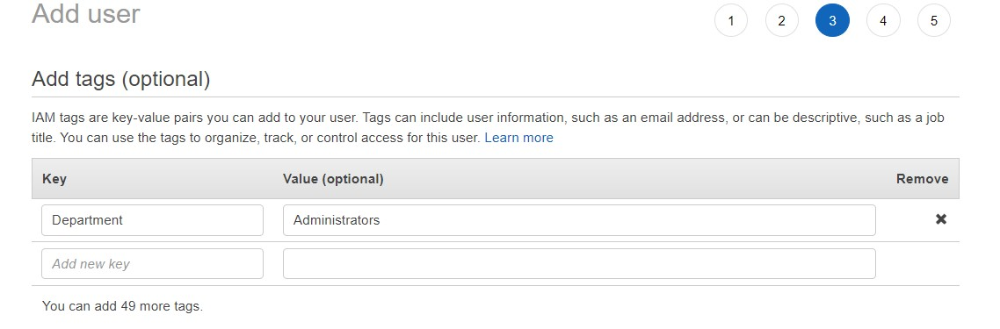

# How to create users and groups in AWS IAM service and assign permissions to user
## AWS Identity and Access Management

AWS IAM service is where you control who can access to what resources in AWS services.

When you create an AWS account, AWS assigns you a root user which is practically the owner of the account. However, it is not advisable to stick to the root user account when using AWS services for security purposes. Therefore, it is a best practice to create users and groups for using AWS services within your account.

At first, creating another user for just ourselves may seem unnecessary, however, considering the vast amount of services that AWS offers, it is safer to add another layer of protection to our accounts by employing users. Also, if you set up the account for a company of any size, it would be best to create user accounts for each employee so that they can use AWS services to the extent that they are permitted.

So how do we do that? Just follow along and see how IAM works.

1. Log in to the console and enter IAM in the search bar and choose IAM service.

2. Click on “Users” from the left hand side menu

3. Click on “Add users” for adding a new user.

4. Provide a name for the user

5. Select AWS access type for the user. There are two access types.

The first is programmatic access which means that users can access to their account using AWS Command Line Interface (CLI), Application Programming Interface (API), or Software Development Kit (SDK).

The second is the management console which is the console that we are currently working on to create a new user.

You can choose either one or both depending on your way of using the services.

6. If you choose AWS Management Console, then you need to configure the password options.

You can specify a password yourself or you can ask AWS to create an autogenerated password.

Also you can force the users to change their passwords at their first sign in.

Once you are done here click on next.

7. The next phase is where you set permissions for the user. There are three options for granting permissions to a user.

The first one is to add user to a group. Groups have their own policies for permissions so when you add a user to a specific group, you automatically grant group permissions to that user. If you do not have a group; however, you want to add this user to a group, then you can choose this option and create a group immediately.

The second option is to copy permissions from an existing user. You can choose this option if you already have another user and you want to grant the same permissions.

The last option is to attach existing policies directly.

8. For this tutorial I am going to choose Add user to a group option and create a new group. I will also attach a policy to the new group so that you can understand how attaching a policy to a group or a user works.

So first, choose “Add user to group” and then click “Create group”

9. At this stage the first thing to do is to name your group. For the tutorial, I named the group Administrators. It is a good practice to name the groups based on their functions (Administrators, Sales, Accounting etc).

Then you need to attach a policy to to the group. You can either create a new policy or attach an existing policy. For the tutorial, I choose to attach an existing policy. However there are too many policies so I entered Administrator in the search field to filter down the policies.

Then chose “AdministratorAccess” from the list by putting a tick sign next to it.

Finally click on “Create group” to finish the group process.

10. Now we are back to the “Add user” page and as you can see the group name is automatically ticked. All you have to do is click on next at the bottom left hand side of the page which takes you to the “Tags” section.

11. Tags is an optional section; however, if you have many people working for various departments it is a good way to filter them out. Tags work in key-value pairs. For the tutorial I chose Department as key and Administrators as value. Then click on next.

12. Now you can review what you have done and if you are satisfied you can click on “Create user” once again to finish the creating a user process.

13. Congratulations you have created a new user. Now it is very important to store the user credentials in a secure area. The user will need these credentials to log into AWS console or CLI.

You can download the credentials by simply clicking on “Download .csv”.

