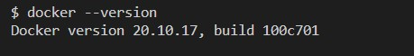
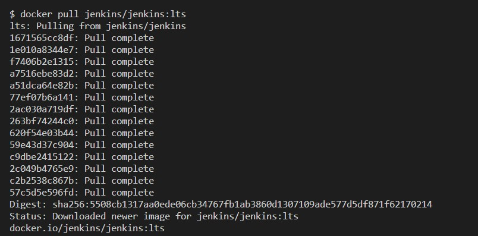
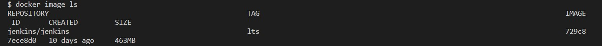
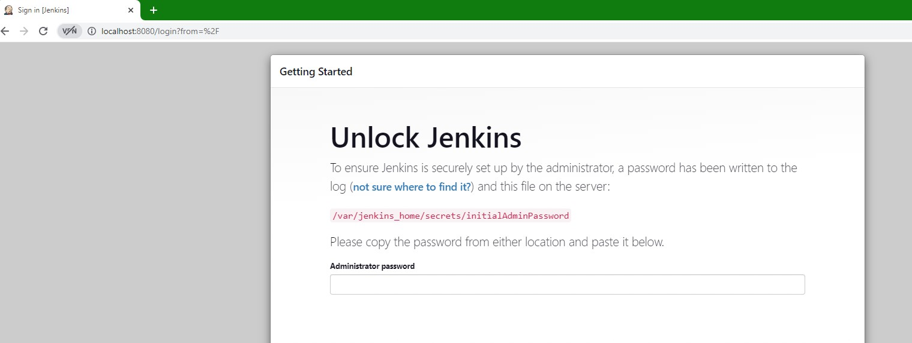
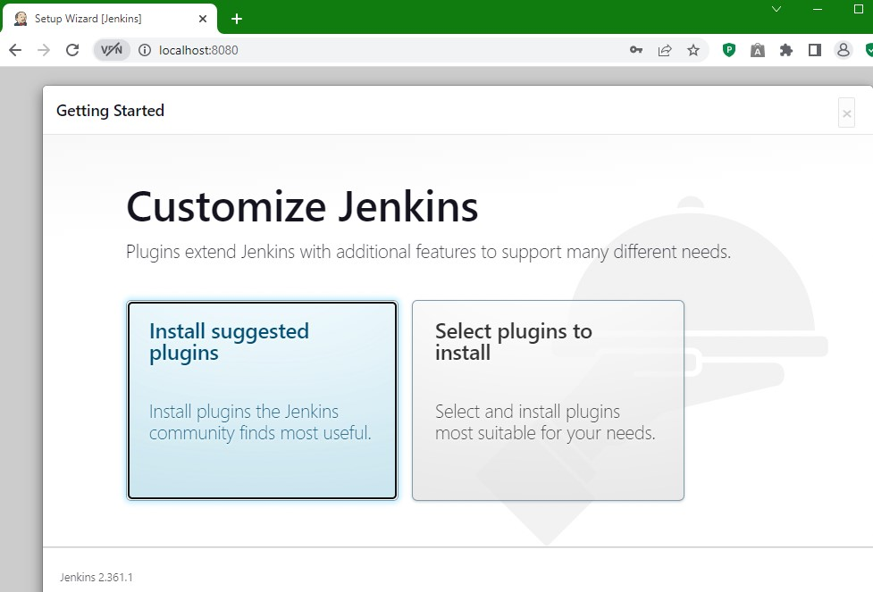
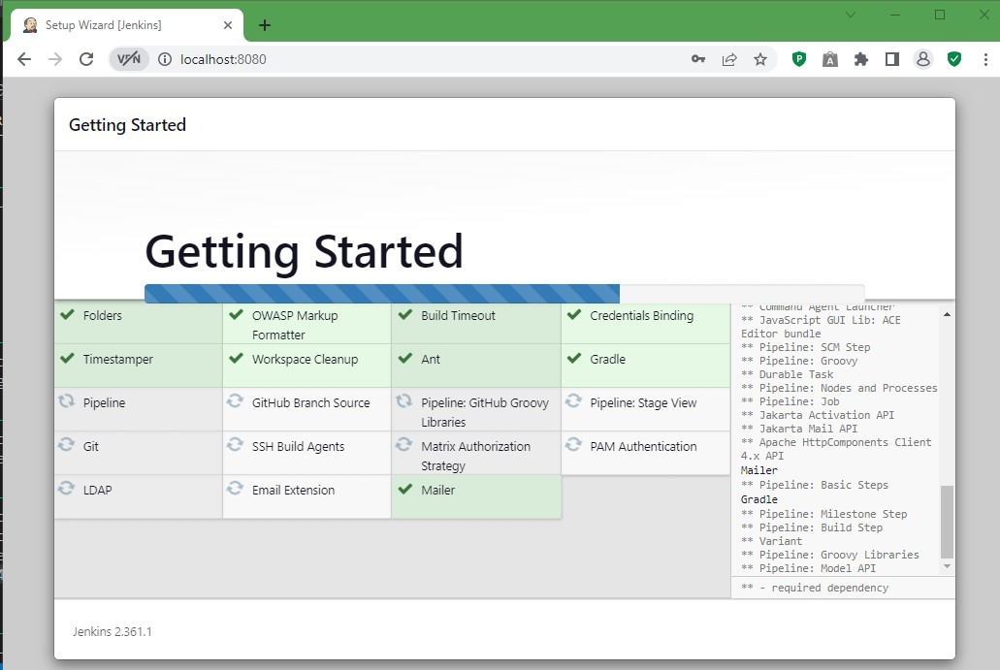
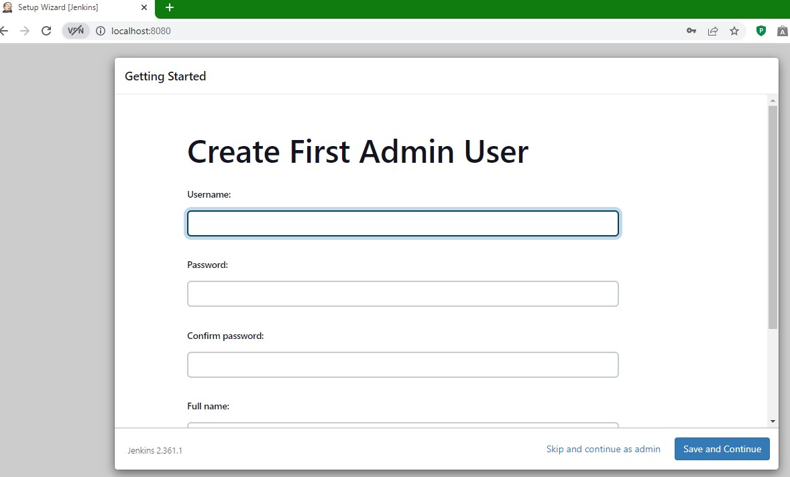
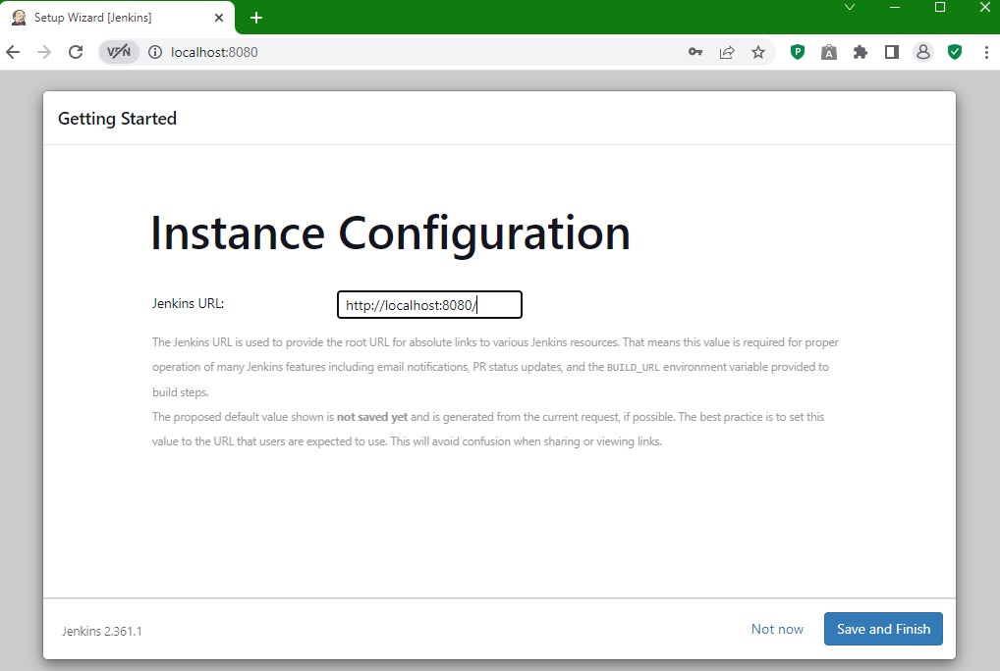
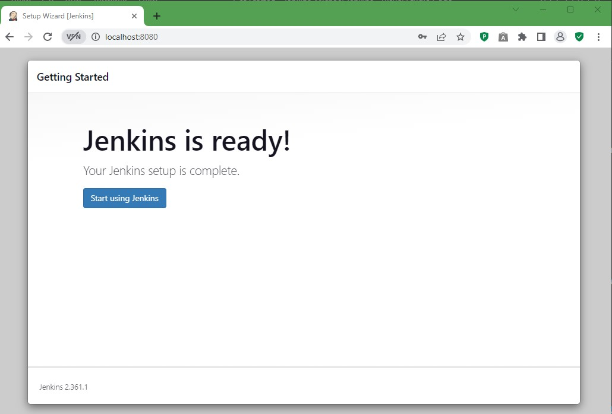

If you are interested in Continuous Integration and Continuous Deployment (CI-CD), Jenkins is your best friend. You can use Jenkins to automate the CI-CD process so that you would have Jenkins at your service at all times to perform tasks on your behalf.
Since it is open source and it is free to install you can get Jenkins at anytime.
Jenkins can be installed on many platforms, such as Linux, Mac and Windows. You can also use Jenkins from a docker container and this guide will help you through the installation of Jenkins in a docker container.

# Prerequisites

You must have Docker installed on your system to install Jenkins on a docker container.

You can install Docker on a local machine or a virtual machine, such as an EC2 instance on AWS.

For this tutorial, I will use my personal computer that runs on a Windows 10 OS.

# Jenkins Installation

1. First things first, check that you have Docker installed on your system.

```bash
docker -- version
```


As you can see, I have Docker version 20.10.17 installed and I am good to go

2. If you are using Docker Desktop like me, do not forget to start it. We can not create a container when we lack a running Docker engine!


3. Pull the Jenkins image from Docker hub.

 ```bash
 docker pull jenkins/jenkins:lts
 ```

You will need to wait several minutes for the image to be pulled completely.



4. Check your docker images to see the Jenkins image

```bash
docker image ls
```


5. Now let's create a container where we can install and run Jenkins.

```bash
docker run --detach --publish 8080:8080 --volume jenkins_home:/var/jenkins_home --name jenkins jenkins/jenkins:lts
```
6. You will get an output like the following if you succeed.

```bash
1cbaa24064227ec708c764a573a44d88ebbd8e62bc2ffbbc29b1e81c0ad7947d
```

7. Now, we need to go to our browser and enter `localhost:8080` to see the Jenkins interface. 

8. We will first need to unlock Jenkins



9. In order to do that we need to get the password from `/var/jenkins_home/secrets/initialAdminPassword`
Since this file is now in the container we need to find a way to go into the container and get the pasword.
We can do that with a `docker exec`command

```bash
docker exec jenkins cat /var/jenkins_home/secrets/initialAdminPassword
```
Oops! This returned an error

```bash
cat: 'C:/Program Files/Git/var/jenkins_home/secrets/initialAdminPassword': No such file or directory
```
10. Since we are not in Linux environment, we need a trick to make the terminal look into the container instead of looking for the Windows file system.
We edit the command and use double // instead of single / in the command.

```bash
docker exec jenkins cat //var//jenkins_home//secrets//initialAdminPassword
```
11. There we go! We have the password! It will look something like this

```bash
1b6cbde50c1d457096f06103aceb24a8
```
12. Copy this password and paste it to the required field and then click on continue on the bottom left.

13. Now, we will start customizing Jenkins. Let's click on `Install suggested plugins`



14. You will need to wait several minutes for the plugins to be installed.



15. Once the installation is over, you will be promted to create first admin user and password.


Just fill the form and click on `save and continue `
16. Finally you will see the instance configuration page and you should click on `save and finish`.



17. Congratulations, Jenkins is ready for you on a Docker container!

