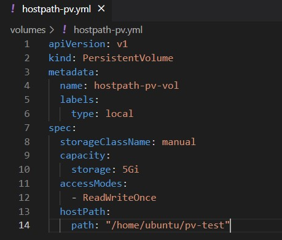
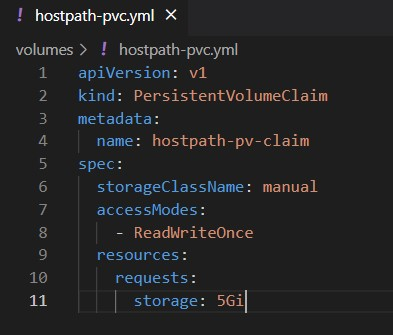
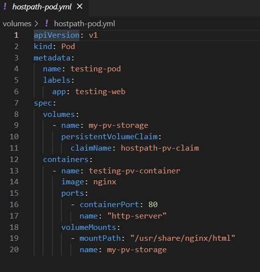
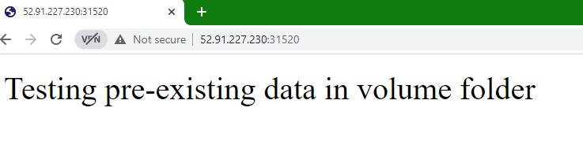
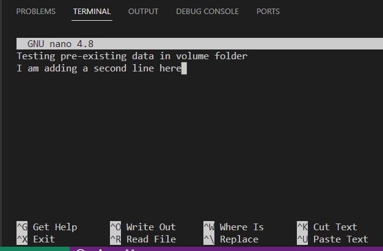
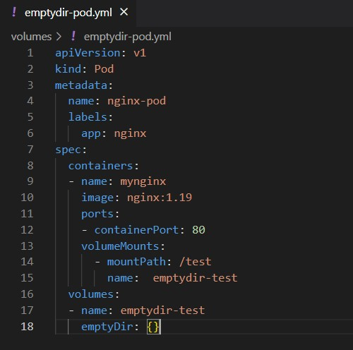
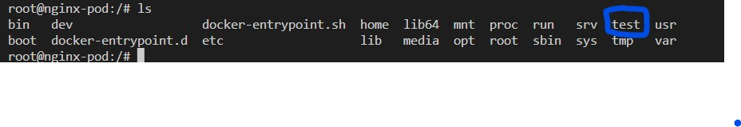
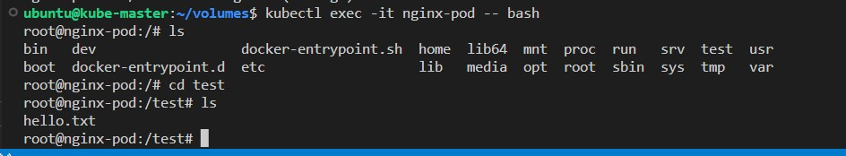

You create a pod and then start working on it. You log into the container using exec command and you realize that you can create files and folders. Wow! Your containers have volume. So what?

Well, that volume is unfortunately ephemeral. Meaning that they vanish as soon as the containers are terminated. And the pods are easily terminated. Of course, the containers are immediately renewed however the data is long gone.

So what can we do to safeguard our data. Well, Kubernetes offers volumes for this. You can see a full list of all volume types here at the Kubernetes documentation. In this hands on study, I will guide you along creating two specific volume tpes: hostpath and emptydir.


# Static Provisioning of Persistent Volumes

Before moving on to specific volumes, it would be better to explain how static volume provisioning process occurs.

1. In general, cluster administrators oversee the strorage devices and storage capacity and evaluate storage needs of containers.

2. Based on these evaluations, they create persistent volumes (PV). A persistent volume is a piece of storage within the cluster. When a PV is created , it becomes available for use.

3. When users need storage for their containers, they create Persistent Volume Claims (PVC) in which they can specify specific storage needs (example: 5Gi)

4. Control plane matches PVCs with the existing PVs. 

5. If there is a match, a PVC is bound to a PV.

6. Then, the user configures a pod to use that PVC

# Prerequisites

As usual, we will need a Kubernetes cluster to work on volumes.

Let's check the nodes
```
kubectl get nodes
NAME            STATUS   ROLES           AGE     VERSION
kube-master     Ready    control-plane   2m29s   v1.25.0
kube-worker-1   Ready    <none>          89s     v1.25.0

```
We are good to go !

# Hostpath

According to Kubernetes documentation, a hostPath volume mounts a file or directory from the host node's filesystem into your Pod. 

In other words, you use a specific directory or folder in the node's file system and mount it to your pod. So your pod will use the NODE in terms of storage.

What if we mount a folder and it already has data in it? How about the data in that folder? We will find out what happens to that data

1. In order to understand this issue, let's first log in to your worker node and create a folder there.

```bash
ssh -i "yourkey.pem" ubuntu@publicIPaddressofyourWORKERinstance
```
2. Create a folder in your home directory and cd into it

mkdir pv-test && cd pv-test

3. Create an index.html file and write "Testing pre-existing data in volume folder" in that file.

```bash
echo "Testing pre-existing data in volume folder" > index.html
```
4. Check with cat to make sure that the file is created with what we have just written

```bash
cat index.html 
Testing pre-existing data in volume folder
```

5. Now, let's go to the master node

```bash
ssh -i "yourkey.pem" ubuntu@publicIPaddressofyourMASTERinstance
```

6. Create a folder, name it volumes and cd into it.

```bash
mkdir volumes && cd volumes
```
6. Let's create a persistent volume with hostPath type



Note that we entered "/home/ubuntu/pv-test" as hostPath which is actually the folder we created in the worker node earlier.

7. Apply the yaml file

```bash
kubectl apply -f hostpath-pv.yml
```

8. Check the persistent volumes to see the pv that we just created

```bash
kubectl get pv
```
```
NAME              CAPACITY   ACCESS MODES   RECLAIM POLICY   STATUS      CLAIM   STORAGECLASS   REASON   AGE
hostpath-pv-vol   5Gi        RWO            Retain           Available           manual                  4s
```

As you can see, we have a PV that has 5Gi storage capacity and is available for grabs.

9. Now, we need to create a persistent volume claim in order to use that persistent volume.

We must make sure that the storageClassName and accessModes options are exactly the same with the ones in the persistent volume.


10. Apply the yaml file

```bash
kubectl apply -f hostpath-pvc.yml
```

11. Now, if we check both the pv and pvc we will see that tahy are bound to each other.

```bash
kubectl get pv,pvc
NAME                               CAPACITY   ACCESS MODES   RECLAIM POLICY   STATUS   CLAIM                       STORAGECLASS   REASON   AGE
persistentvolume/hostpath-pv-vol   5Gi        RWO            Retain           Bound    default/hostpath-pv-claim   manual                  6m8s

NAME                                      STATUS   VOLUME            CAPACITY   ACCESS MODES   STORAGECLASS   AGE
persistentvolumeclaim/hostpath-pv-claim   Bound    hostpath-pv-vol   5Gi        RWO            manual         8s
```

12. We have a volume but we have no use for it unless we have a pod, right? Then let's create a pod that uses the PV that we created.



Here, we just created a pod that uses the PV we created earlier. We built the container using an Nginx image that uses "/usr/share/nginx/html" as the container mountPath. This is at the container level and this mount point uses "/home/ubuntu/pv-test" as persistent volume.

13. Apply the yaml file

```bash
kubectl apply -f hostpath-pod.yml
```

14. To get the answer to the question we asked above, let's go into the container.

```bash
kubectl exec -it testing-pod -- /bin/bash
```
15. Run curl command to get the index.html page for Nginx


When you create a container with Nginx image, you normally get the Nginx test page after a curl command. But as you see the index.html page automatically got the content from the "/home/ubuntu/pv-test". So we got exactly what we have written in the index.html file that we created at the beginnigng of the hands on.

16. To make things more interesting, let's expose the testing-pod as a new Kubernetes service on master.

```bash
kubectl expose pod testing-pod --port=80 --type=NodePort
```

17. Check the services to see the nodePort port number

```bash
kubectl get svc
NAME          TYPE        CLUSTER-IP       EXTERNAL-IP   PORT(S)        AGE
kubernetes    ClusterIP   10.96.0.1        <none>        443/TCP        62m
testing-pod   NodePort    10.104.250.229   <none>        80:31520/TCP   100s
```

17. Now go to your browser and enter your worker node's public IP followed by the nodePort port number to see the index.html



18. Now, I will ssh into the worker node once again and modify the pv-test folder which has the index.html. We will see if it will affect our container that uses hostPath volume type and specifically the testing-data folder.

19. I will open the index.html with nano editor (you can use vim or any other editor) and add a new line of text



20. Now, let's check back the browser to see what happened?


Wow! The website changed as well!


# Emptydir

Unlike the hostpath that creates a folder inside the node, the emptyDir creates a folder inside the pod. This folder lives as long as the pod lives.

Note : A container crashing does not remove a Pod from a node. The data in an emptydir volume is safe across container crashes.

1. First, let's delete the pods, services, cpersistent volumes and claims that we created for cleaning purposes.

```bash
kubectl delete -f .
pod "testing-pod" deleted
persistentvolume "hostpath-pv-vol" deleted
persistentvolumeclaim "hostpath-pv-claim" deleted
pod "testing-pod" deleted
```

2. We can create a pod and add emptydir at the same time.

`bash


3. Let's apply the file

```bash
kubectl apply -f emptydir-pod.yml
```
4. Note that we entered volume as empty-dir and we also added a folder with the name of test as the mountPath. This will create a folder inside the container with the name `test`ad use it as volume.

5. Now, go inside the container 

```bash
kubectl exec -it nginx-pod -- bash
```

6.Check if the test folder is indeed created.
```bash
ls
```


As you can see the test folder is created.

7. Now, we will create a text file in test folder.

```bash
echo "Hello World" > hello.txt
```

8. Now that we created the file, we will see what happens if the container is terminated.

9. Exit the container in the master node and ssh into your worker node again

10. Run the following command to see the running containers

```bash
sudo ctr --namespace k8s.io containers ls
```


11. Remove the nginx container

```bash
sudo ctr --namespace k8s.io tasks rm -f <enter the full container-id> #STOP
sudo ctr --namespace k8s.io containers delete <enter the full container-id> # DELETE
```

12. Go back to the master node and once again log into the nginx-pod container. Remember we just deleted it from the worker node but the Kubelet created a new container.

```bash

kubectl exec -it nginx-pod -- bash
```

13. Let's run an `ls `command and check if the hello.txt file is still there



We just confirmed that the data in the epmtydir folder remained even after we terminated the container.