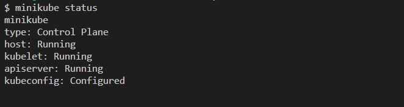
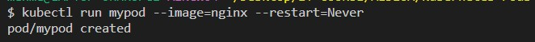
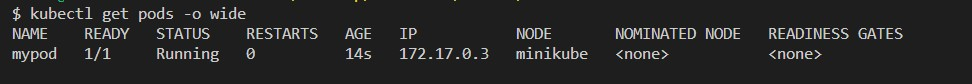
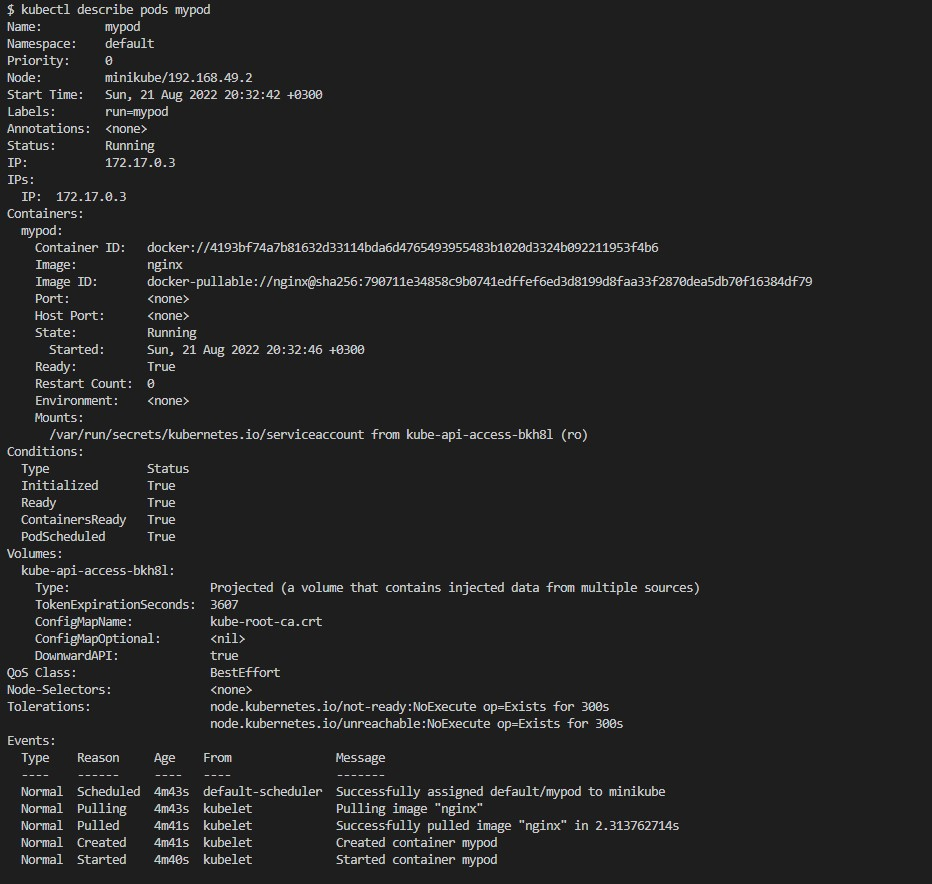
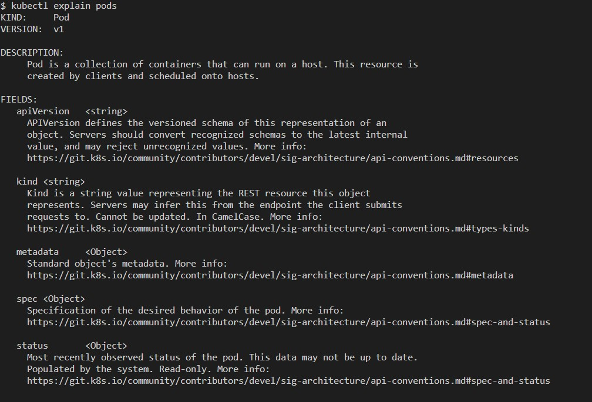
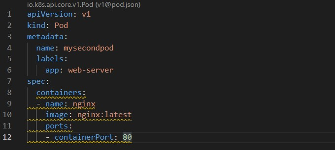
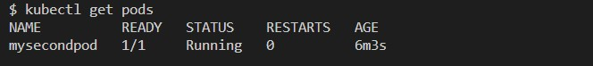

# Virtualization and Containerization
When my daughter started Pre-K more than a decade ago, I and several of my neighbors decided to carpool our children to their Kindergardan. We each had a car and instead of having only one child in a car that can host several children, we decided to share our resources and save gas money and of course time.
At that time, it did not occur to me that this was no different than using virtualization. Instead of using one computer with lots of memory and cpu for a single application, virtualization opened the way for creating several virtual machines on the same computer and share the resources in an efficient way.
Containerization, on the other hand, raised the bar so high that almost no resource is wasted and left aside. Instead of using a large operating system, we can now use containers with just enough software to run themselves and host our applications.
In just one host, now we can run multiple containers, each serving a different purpose.
Now that we have tons of containers, how are we going to manage them?
Well, this is where container orchestration comes to our help. And Kubernetes, is by far the most popular container orchestration tool that is available to us and it is free to use.

# Kubernetes Pods
Kubernetes documentation describes Kubernetes objects as persistent entities in the Kubernetes system. To describe all types of objects is beyond the purpose of this medium story so we will only stick to explaining one type of object: Pods.

Pods are the smallest managebale units in the Kubernetes System. We cannot say that a pod is a container but we can safely say that a pod is the closest object to a container.

While we can create multiple containers within a pod, the best practice is to create one container per pod. That is why a pod resembles a container.

If we compare a pod with a docker container we can say that a pod is just like a group of docker containers that share the same namespace and volume.

# Creating pods: Imperative vs Declarative Methods.

In Kubernetes, we can create pods in two different ways. The declarative method only indicates the end product and does not provide step by step commands on how to create the end product. Imperative method, on the other hand includes the commands.

For the declarative method, we use YAML (Yet Another Markup Language) files to present the configuration of what we desire to be the end product.
For imeperative method, we simply use a terminal, such as bash to convey the commands.

In the next section, we will create pods by using both of the methods and see the differences. However, we must note that Kuberenetes recommend using declarative methods.

# Creating a pod using imperative method

First of all, you must be running a Kubernetes Cluster in order to be able to create pods and other objects. For this tutorial, I am going to use minikube. We can check the status of minikube by entering the `minikube status`command.

1. First, let's check if we have any pods. We do that by using `kubectl get pods`command.

As you can see, we do not have any pods now.
2. In order to create a pod we use `kubectl run` command with some options. For the tutorial, I will create a pod, name it `mypod`, will use nginx as base image, and will adjust the restart policy to `Never`which means that if for some reason my container failss, it will not restart automatically.
```bash
kubectl run mypod - image=nginx - restart=Never
```

3. Let's check once more to see the pods.
```bash
kubectl get pods
```

4. If we want to get a more detailed information, we can use `-o wide` flag.

Congratulations, you created your first pod.
5. If you think the information is still limited, then try the following command to get a detailed information regarding your pod.
```bash
kubectl describe pods ENTERNAMEOFYOURPOD
```

6. Pay attention to the last part which details the events that resulted in the creation of the pod. This section is particularly important for troubleshooting purposes.
7. Finally, we can delete a pod with the `kubectl delete pods `command

8. Let's check again the list of pods.

As you can see we no longer have a pod.


# Creating a pod using declarative method

1. In order to create a pod using a declarative method, we need to create a yaml file and prepare a template.
```bash
touch mysecondpod.yml
```
2. Now that we have the yaml file, how do we fill it in? The answer is actually in the terminal. Just enter the `kubectl explain pods` command.

3. As you can see from the output, the necessary fields are apiVersion, kind, metadata, spec, and status.
4. Also note that we are provided with the KIND and VERSION of a pod at the beginning of the output. Therefore, we will use them in the yaml file.
4. With regards the status part, Kubernetes will present it for us so we do not need to enter it.
5. Finally, we need to fill in the metadata and spec parts. Metadata is where we provide a name for the pod, and spec provides specification of the desired behavior of the pod.
6. Now, open the yaml file in an editor of your own choice and lets fill it in.

7. What we did wast to name our pod as `mysecondpod`, and then create a container inside my pod with the name nginx and use nginx:latest image to build the container image and also use port 80 to expose the container.
8. Now we need to declare what we want with the apply command.
```bash
kubectl apply -f mysecondpod.yml
```

9. Let's check the list of pods.

Congratulations. You have created a pod using a declarative method.
10. Now, we can delete the pod.
```bash
kubectl delete pod mysecondpod
```
11. Check the list of pods again
```bash
kubectl get pods
```


# Difference between Imperative and Declarative Method

Although we can use both methods to create pods, declarative method has a major advantage compared to imperative method.

First of all, you do not need to go over and enter commands manually each time you want to create a new pod. You simply modify the yaml file and you are good to go with a simple apply command.

Secondly, declarative method provides version control of the container. You can edit your yaml file, enter let's say new labels or annotations and save it and apply it. You will have the same container with updated metadata after re applying the `kubectl apply -f mysecondpod.yml` command. On the other hand if you try to change the label and run the imperative command `kubectl run mypod --image=nginx --restart=Never` you will get an error indicating that you already have a container with that name.