Authentication and Authorization: x509 Client Certificates and Role Based Access Control (RBAC)

When you work for a company that employs Kubernetes clusters, you must be authenticated and authorized to access those clusters. But this process is somewhat different from many other systems where you can simply create a new user and provide the user with certain permissions. This is because Kubernetes does not offer an object for creating a user account. Instead, Kubernetes lets you employ solutions, such as X509 Client certificates, static token files, OpenID Connect tokens and Webhook token authentication.

In this tutorial, I am going to walk you through authenticating and authorizing a user to access Kubernetes Clusters.

# Prerequisite
I will be using minikube to demonstrate the steps in this tutorial. You can use minikube or any other tool to follow along.

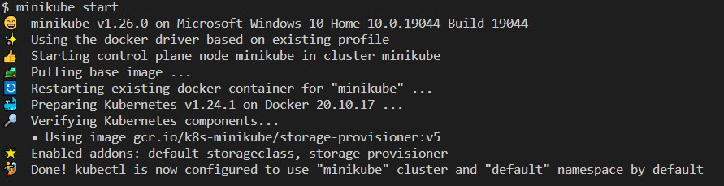

## Authenticating a user

1. We will start with creating new folder to store new user certificates

```bash
mkdir newusercrt
cd newusercrt
```
2. We need to create a Private key for the new user. We will create the key using OpensSSL whcih is an open-source command line tool for generating private keys, as well as creating CRSs. I will name my key as `newuser.key`. You can change the name to whatever you like.

```bash
openssl genrsa -out newuser.key 2048 
```


3. Now, we will create a certificate signing request (CSR) with the private key. I will save the output as newuser.pem. 
Note that I will use -subj flag to enter a username and a group name for that user. 

```bash
openssl req -new -key newuser.key -out newuser.csr -subj "/CN=mehmet/O=Devops"
```

4. Now it is time to create the certificate with the following command. I will name the certificate as `mehmet`. You can name it differently. The certificate will be encoded with base 64.

```bash
cat <<EOF | kubectl apply -f -
apiVersion: certificates.k8s.io/v1
kind: CertificateSigningRequest
metadata:
  name: mehmet
spec:
  groups:
  - system:authenticated
  request: $(cat newuser.csr | base64 | tr -d "\n")
  signerName: kubernetes.io/kube-apiserver-client
  usages:
  - client auth
EOF
```

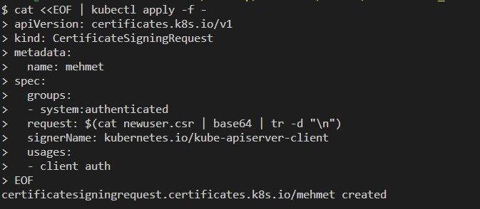

5. Let^s check csr with kubectl

```bash
kubectl get csr
```
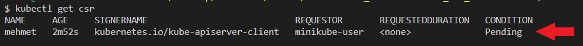

As you can see mehmet is created;however, it is pending status. 

6. In order to change the status, we need to approve csr.

```bash
kubectl certificate approve mehmet
```

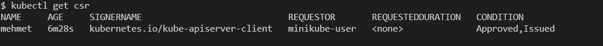

7. Now we will save the certificate to a file. We will decode from base 64 and save it to a file and name the file as newuser.crt

```bash
kubectl get csr mehmet -o jsonpath='{.status.certificate}' | base64 -d >> newuser.crt
```

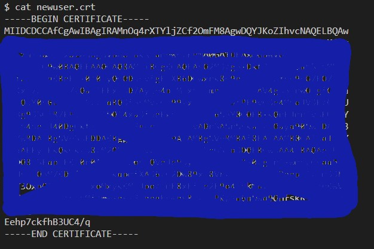

8. At this step, we will set credentials for the new user.

```bash
kubectl config set-credentials mehmet --client-certificate=newuser.crt --client-key=newuser.key
```


9. Now it is time to create context so that the new user can use the cluster. I will name the context as mehmet-context. You can name differently as you wish.

```bash
kubectl config set-context mehmet-context --cluster=minikube --user=mehmet
```


10. Let's use the new context

```bash
kubectl config use-context mehmet-context
```


11. Let's check the resources in the cluster.

```bash
kubectl get nodes
```

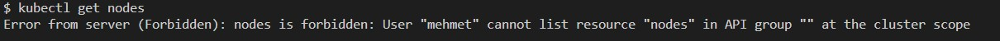

We got an error message. We authenticated our new user ( mehmet in my case), but we have yet to authorize! Therefore, my new user is not able to access resourcess.

12. Here we will use Role Based Access Control (RBAC) to authorize users. In RBAC, we can use a Role object and then bind it with a RoleBinding object or we can create a ClusterRole object and bind it with ClusterRoleBinding object. While role object is only valid in a specified namespace, clusterrole is valid throughout the cluster. Also, clusterrole is used for objects that are independent of namespaces like nodes.

13. For this tutorial, I will create a Role object and a Rolebinding object.

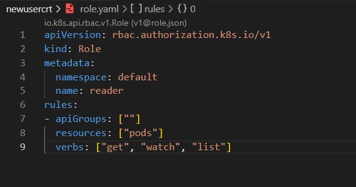

In the role manifest file, we specify the namespace under metadata, and we determine the permissions for the user under rules. We define the resources that the user can access (pods only in my case) and the operations that the user can employ on that resource (read only in my case)

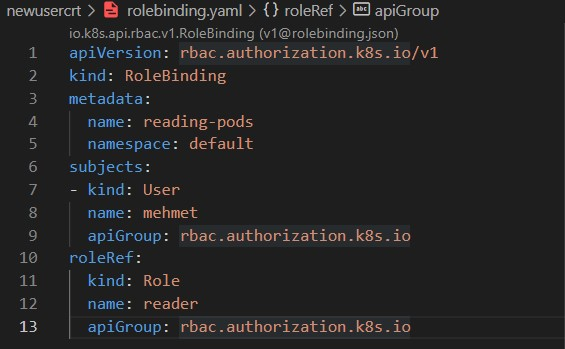

In the rolebinding manifest file, we specify the namespace under metadata, we include user name under subjects, and we ensure that the name under roleRef is the same with the name under metadata of role manifest file. 

14. On step 10, we changed the context to new user (mehmet-context in my case). In order to authorize the new user, we must go back to default context.

```bash
kubectl config use-context minikube
```

15. Now, we will send manifest files to KubeAPI

```bash
kubectl apply -f .
```
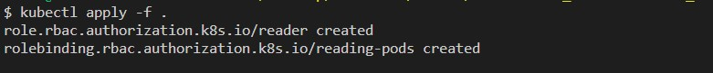

16. We can go back to new user context again.

```bash
kubectl config use-context mehmet-context
```

17. Now, let's check the pods.

```bash
kubectl get pods
```

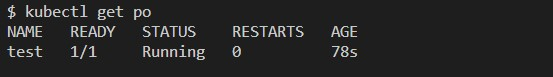

We authorized the new user to read pods so when we checked the pods we got a positive reponse.

18. Now, let's try creating a new pod.

```bash
kubectl run test2 --image=nginx
```

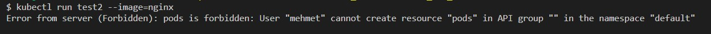

Well, we were just authorized to read not write, so our attempt to create a new pod did not go through.
If we want to authorize the new user with more permissions, then we need to modify the role manifest file and add more verbs, such as "post", "put", "create", "update", "patch", and "delete" under rules. You can try this yourself!

