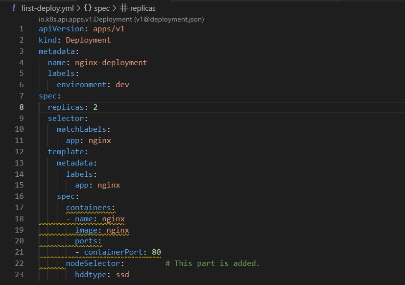

Kubernetes is a great tool in orchestrating our containers. We can use deployments, replica sets, and pods to create our containers as we wish. 
By default, Kubernetes work as a cluster with at least one master node and one or more worker nodes. Either when we apply a deployment file with many replicas or when we  create just a single pod, kube-scheduler is immediately alerted. Because it is the duty of the kube-scheduler to make the optimal decision to assign the pods to the nodes.

When making the decision,kube-scheduler checks for available resources as well as the pod requirements. After carefully examing all these factors, pods are assigned to nodes.

By default, we cannot determine which nodes will get the new pods. But the kube-scheduler can! However, there is a way for us to determine which nodes get which pods. In other words, we may have a say in determining the pod scheduling. In this story, I will explain the methods that can be used to determine pod scheduling.

# Prerequisites
We need to have a K8s cluster with at least one master node and one worker node ready (We will assign pods to different nodes so we need at least two nodes). You can easily set up a K8s cluster using AWS EC2 instances if you know how.

Another option is working locally with minikube just like me. For those of you who are familiar with minikube may wonder how I can work with minikube since it only offers a single node which acts as both the master and the worker node. Well, minikube has actually a multi node option. If you dig through minikube documentation you can find more information on multi-node clusters in minikube. 

Or you can just follow along by running the following command on your local terminal!

```bash
minikube start --nodes 2 -p multinode-demo
```


Now, let's check our nodes

```bash
kubectl get nodes
```


# Scheduling Pods to Nodes

# Using nodeName

When we work with nodes, each node has a name in the Cluster. For example, we can name the master node as Kube-master or Control-Plane and we can name the worker nodes as worker-1, worker-2 etc. This naming practice is arbitrary by default and we can name our nodes as we wish.
Once the node has a name then we can use the nodeName spec to refer to a specific node.

Since I am using minikube, my node names will be multinode-demo and multinode-demo-m02.

Before showing you the nodeName, let's create a deployment file and see how the pods are assigned.

```bash
touch first-deploy.yml
```

Then populate the file with a sample deployment.


Now , we can apply the deployment file.

```bash
kubectl apply -f first-deploy.yml
```


Let's check how the pods are distributed.
```bash
kubectl get pods
```


As you can see, each node got one pod each out of two replicas.

Now, let's delete the deployment file.
```bash
kubectl delete -f first-deploy.yml
```

We can now see that no pods are left.
```bash
kubectl get pods
```


At this point we can modify the first-deploy.yml file and we can add a nodename spec. We will use the same first-deploy.yml file and we will only include "nodeName: multinode-demo" as part of the spec.


Now , we can apply the modified deployment file.

```bash
kubectl apply -f first-deploy.yml
```


Let's check how the pods are distributed after we added a nodeName spec.
```bash
kubectl get pods -o wide
```


As we  expected, the pods are only assigned to "Multinode-demo" node since we added its name to the nodeName spec.

Let's clear the scene before moving on to the next option.

```kubectl delete -f first-deploy.yml
```

# Node Selector
nodeSelector is another option that we can use in order to manipulate pod scheduling. nodeSelector works under the spec as key-value pairs. Although we can use multiple key-value pairs, the best practice is to use a single pair.

But before modifying our deployment file and add a nodeSelector, we must first add a label to the node that we want our pods to be hosted.

```bash
kubectl label nodes multinode-demo-m02  hddtype=ssd
```


Now, we have a node that has a label of hddtype=ssd. Let's check to see that only one node has that label.

```bash
kubectl get nodes -l hddtype=ssd
```


We can now modify the first-deploy.yml file. We will delete the nodeName part and instead we will add a nodeSelector part.



Let's apply the deployment file.
```bash
kubectl apply -f first-deploy.yml
```

Let's check how the pods are distributed after we added a nodeSelector spec.
```bash
kubectl get pods -o wide
```


As we  expected, the pods are only assigned to "Multinode-demo-m02" node.