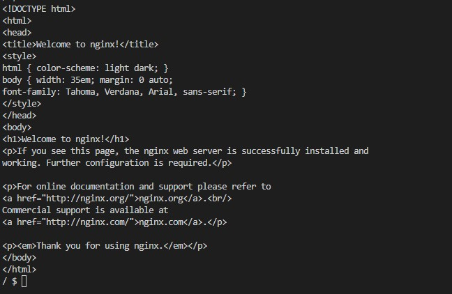
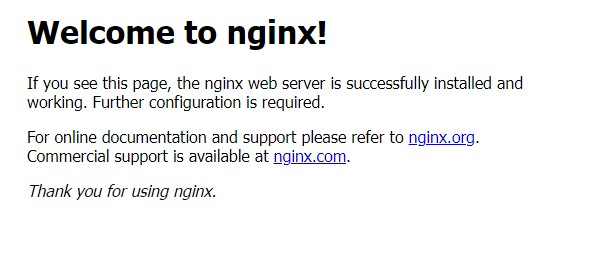

Kubernetes Services: ClusterIP vs Nodeport

Kubernetes work with containers in the form of pods. We can either create a single pod with a pod object or multiple pods using replicasets or deployment objects. In any case we will end up with bunch of pods and at some point we will need to access to that pods.

In cluster networking, containers can reach to other containers within a pod by employing localhost communications. The way containers behave is as if they are on the same host. No problem about that!

When it comes to pod to pod communication, IP address seems to be the solution. Because each pod has a unique cluster-wide IP address. However, there is a shortcoming when it comes to this kind of communication. Pods have a habit of being terminated whenever they fail or when we scale down our replicas. Of course the terminated pods are replaced with the new ones;however, new pod means a new IP address. How are we going to keep up with all the new IP addresses?

Kubernetes service objects offers a solution to this problem. When we create a service object, it comes with a virtual IP address and that IP address remains constant as long as the service is alive. By using selectors, we can link pods to services and and all pods can communicate with each other through the service eliminating the pod IP address process. Therefore, terminating a pod and renewing it with a new IP wont matter after all. In short, `Services` provide network connectivity to Pods that work uniformly across clusters.

Kubernetes Service object also provides a kind of load balancing and kube-proxy load balances connections to the virtual IP across the group of pods backing the service.

Kubernetes offers four major service types:
• ClusterIP (default)
• NodePort
• LoadBalancer 
• ExternalName

From those four types, we will cover the first two service types: ClusterIP and NodePort.

# Kubernetes Cluster

For the hands on study, we will need two nodes. There are several options for you to apply. You can use Minikube with two nodes on your local to create two nodes.
Or, you can spin up two EC2 instances to create a Kubernetes Cluster. You can do this manually from AWS Console, use CloudFormation stacks or use Terraform files to create your instances. Choose the method that you are familiar with.

I personally prefer to use Terraform files. For those of you who will use Terraform, here are the two .sh files that I refer in the Terraform main.tf when I create my resources.

I will not go into explaining each Terraform file as it is not the subject of this story. However, I will just mention that besides the regular create resource options, I added two data sources to main.tf as follows.

```bash
data "template_file" "worker" {
  template = file("worker.sh")
  vars = {
    region = data.aws_region.current.name
    master-id = aws_instance.master.id
    master-private = aws_instance.master.private_ip
  }

}

data "template_file" "master" {
  template = file("master.sh")
}

```
These two data files create the master and worker environment as I wish. Here are the files referenced in data section.

Master.sh
```bash
#! /bin/bash
apt-get update -y
apt-get upgrade -y
hostnamectl set-hostname kube-master
chmod 777 /etc/sysctl.conf
echo "net.ipv4.ip_forward=1" >> /etc/sysctl.conf
sysctl -p
chmod 644 /etc/sysctl.conf
apt install -y docker.io
systemctl start docker
mkdir /etc/docker
cat <<EOF | tee /etc/docker/daemon.json
{
  "exec-opts": ["native.cgroupdriver=systemd"],
  "log-driver": "json-file",
  "log-opts": {
    "max-size": "100m"
  },
  "storage-driver": "overlay2"
}
EOF
systemctl enable docker
sudo systemctl daemon-reload
sudo systemctl restart docker
usermod -aG docker ubuntu
newgrp docker
apt install -y apt-transport-https
curl -s https://packages.cloud.google.com/apt/doc/apt-key.gpg | sudo apt-key add -
apt-add-repository "deb http://apt.kubernetes.io/ kubernetes-xenial main"
apt update
apt install -y kubelet kubeadm kubectl
systemctl start kubelet
systemctl enable kubelet
kubeadm init --pod-network-cidr=172.16.0.0/16 --ignore-preflight-errors=All
mkdir -p /home/ubuntu/.kube
cp -i /etc/kubernetes/admin.conf /home/ubuntu/.kube/config
chown ubuntu:ubuntu /home/ubuntu/.kube/config
su - ubuntu -c 'kubectl apply -f https://docs.projectcalico.org/manifests/calico.yaml'
```

Worker.sh
```bash
#! /bin/bash
apt-get update -y
apt-get upgrade -y
hostnamectl set-hostname kube-worker-1
chmod 777 /etc/sysctl.conf
echo "net.ipv4.ip_forward=1" >> /etc/sysctl.conf
sysctl -p
chmod 644 /etc/sysctl.conf
apt install -y docker.io
systemctl start docker
cat <<EOF | tee /etc/docker/daemon.json
{
  "exec-opts": ["native.cgroupdriver=systemd"],
  "log-driver": "json-file",
  "log-opts": {
    "max-size": "100m"
  },
  "storage-driver": "overlay2"
}
EOF
systemctl enable docker
sudo systemctl daemon-reload
sudo systemctl restart docker
usermod -aG docker ubuntu
newgrp docker
apt install -y apt-transport-https
curl -s https://packages.cloud.google.com/apt/doc/apt-key.gpg | sudo apt-key add -
apt-add-repository "deb http://apt.kubernetes.io/ kubernetes-xenial main"
apt update
apt install -y kubelet kubeadm kubectl
systemctl start kubelet
systemctl enable kubelet
apt install -y python3-pip
pip3 install ec2instanceconnectcli
apt install -y mssh
until [[ $(mssh -o UserKnownHostsFile=/dev/null -o StrictHostKeyChecking=no -r ${region} ubuntu@${master-id} kubectl get no | awk 'NR == 2 {print $2}') == Ready ]]; do echo "master node is not ready"; sleep 3; done;
kubeadm join ${master-private}:6443 --token $(mssh -o UserKnownHostsFile=/dev/null -o StrictHostKeyChecking=no -r ${region} ubuntu@${master-id} kubeadm token list | awk 'NR == 2 {print $1}') --discovery-token-ca-cert-hash sha256:$(mssh -o UserKnownHostsFile=/dev/null -o StrictHostKeyChecking=no -r ${region} ubuntu@${master-id} openssl x509 -pubkey -in /etc/kubernetes/pki/ca.crt | openssl rsa -pubin -outform der 2>/dev/null | openssl dgst -sha256 -hex | sed 's/^.* //') --ignore-preflight-errors=All
```


##
Services are created just like any other objects in Kubernetes. For this study, I am going to employ declarative method and create YAML files which will create the services I need. I will use both ClusterIp and NodePort types to explain the difference between them.

# ClusterIP

ClusterIP is the default service type in Kubernetes. When creating a service, if you omit the service type, it will be defaulted to ClusterIP.

The documentation defines ClusterIp as "Exposes the Service on a cluster-internal IP. Choosing this value makes the Service only reachable from within the cluster."

If you do not need your pods to be accessed from outside the cluster you can use this type of service.

1. Before diving into ClusterIp let's check that we actually have our nodes ready.

```bash
kubectl get nodes

NAME            STATUS   ROLES           AGE   VERSION
kube-master     Ready    control-plane   49m   v1.25.0
kube-worker-1   Ready    <none>          47m   v1.25.0
```

2. Now, let's create a deployment object with three replicas and name the yml file as mydeployment.yml.

```yaml
apiVersion: apps/v1 
kind: Deployment 
metadata:
  name: nginx
spec:
  replicas: 3 
  selector:  
    matchLabels:
      app: nginx
  minReadySeconds: 10 
  strategy:
    type: RollingUpdate 
    rollingUpdate:
      maxUnavailable: 1 
      maxSurge: 1 
  template: 
    metadata:
      labels:
        app: nginx
        env: front-end
    spec:
      containers:
      - name: nginx
        image: nginx
        ports:
        - containerPort: 80

```

3. Apply the deployment file
```bash
kubectl apply -f mydeployment.yml
```

4. Check the deployment and pods

```bash
kubectl get deploy

NAME    READY   UP-TO-DATE   AVAILABLE   AGE
nginx   3/3     3            0           13s

kubectl get pods

NAME                     READY   STATUS    RESTARTS   AGE
nginx-85575f566c-cmkgp   1/1     Running   0          19s
nginx-85575f566c-wnwsl   1/1     Running   0          19s
nginx-85575f566c-zqkrw   1/1     Running   0          19s

```

As you can see we created three pods running nginx images.

5. Check the IP address for the pods

```bash
kubectl get pods -o wide

NAME                     READY   STATUS    RESTARTS   AGE   IP             NODE            NOMINATED NODE   READINESS GATES
nginx-85575f566c-cmkgp   1/1     Running   0          99s   172.16.180.1   kube-worker-1   <none>           <none>
nginx-85575f566c-wnwsl   1/1     Running   0          99s   172.16.180.2   kube-worker-1   <none>           <none>
nginx-85575f566c-zqkrw   1/1     Running   0          99s   172.16.180.3   kube-worker-1   <none>           <none>
```

6.  As you can see each Pod has an IP address which is internal and specific to each instance. Pay attention to the IP addresses and note them as we will come back to this step after Step 13. 

But first things first, let's check whether our pods can communicate with each other. In order to that, we are going to go into a specific pod and than run a ping command to the other pods.

7. We will use exec command to log into a container in the pod.

```bash
kubectl exec -it  nginx-85575f566c-n8hv5  -- sh
```

Note: Do not forget to change the container id as my container id and your container id will not be the same (nginx-85575f566c-n8hv5)

8. Since we used a minimal image for our pods, we will need to install ping command when we go into the container.

First run
```bash
kubectl exec -it nginx-85575f566c-n8hv5  -- sh
```
Then while you are in the container run

```bash
# apt-get update
and
# apt-get install iputils-ping
```
9. Now we can run the ping command

```bash
# ping 172.16.180.2
PING 172.16.180.2 (172.16.180.2) 56(84) bytes of data.
64 bytes from 172.16.180.2: icmp_seq=1 ttl=63 time=0.128 ms
64 bytes from 172.16.180.2: icmp_seq=2 ttl=63 time=0.062 ms
64 bytes from 172.16.180.2: icmp_seq=3 ttl=63 time=0.066 ms
64 bytes from 172.16.180.2: icmp_seq=4 ttl=63 time=0.063 ms
^C
--- 172.16.180.2 ping statistics ---
4 packets transmitted, 4 received, 0% packet loss, time 3051ms
rtt min/avg/max/mdev = 0.062/0.079/0.128/0.027 ms
```
As you can see we can ping other pods.


10. Let's scale down the deployment.

```bash
kubectl scale --replicas=1 deployment nginx
deployment.apps/nginx scaled
```
11. Let's check the pods

```bash
ubuntu@kube-master:~$ kubectl get pods
NAME                     READY   STATUS    RESTARTS   AGE
nginx-85575f566c-zqkrw   1/1     Running   0          9m28s
```
12.  Now, we will scale up the deployment again.

```bash
kubectl scale --replicas=3 deployment nginx
deployment.apps/nginx scaled
```
13. Let's check back the pods and compare the IP addresses that we noted in Steps 5 and 6.

```bash
kubectl get pods -o wide
NAME                     READY   STATUS    RESTARTS   AGE   IP             NODE            NOMINATED NODE   READINESS GATES
nginx-85575f566c-n8hv5   1/1     Running   0          8s    172.16.180.4   kube-worker-1   <none>           <none>
nginx-85575f566c-snsb4   1/1     Running   0          8s    172.16.180.5   kube-worker-1   <none>           <none>
nginx-85575f566c-zqkrw   1/1     Running   0          95m   172.16.180.3   kube-worker-1   <none>           <none>
```

As you can see we have two new pods with two new IP addresses. While we were able to ping the pods, we can not rely on them since every new pod means a new IP address. Therefore we will use a service object.

11. Now let's create a service object with ClusterIp type and name the yml file as myservice.yml

```bash
apiVersion: v1
kind: Service   
metadata:
  name: nginx-svc
  labels:
    app: nginx
spec:
  type: ClusterIP  
  ports:
  - port: 3000  
    targetPort: 80
  selector:
    env: front-end 
```

12. Note that we entered " type: ClusterIP  " in spec field. Now let's apply the file.
```bash
kubectl apply -f myservice.yml 
service/nginx-svc created
```

13. Let's check the services

```bash
kubectl get svc
NAME         TYPE        CLUSTER-IP       EXTERNAL-IP   PORT(S)    AGE
kubernetes   ClusterIP   10.96.0.1        <none>        443/TCP    3h24m
nginx-svc    ClusterIP   10.106.201.163   <none>        3000/TCP   22s
```
As you can see we created a service with the ClusterIp of 10.106.201.163 and port 3000.

14. Remember that we used an Nginx image for the containers. Therefore, we should be able to reach the content via curl. The best way to use curl is to create a seperate pod just for curl purposes. We can use the official curl image from Docker Hub (curlimages/curl)

```bash
kubectl run mycurlpod --image=curlimages/curl -i --tty -- sh
```

15. Now we have our curl pod. Let's go into it

```bash
kubectl exec -it mycurlpod -- sh
```

16. Now we can use the curl command with the service Ip including the port number which is 3000

```bash
curl 10.106.201.163:3000

or by using the service name

curl nginx-svc:3000
```


As you can see we could curl the contents using service Ip address. 

TRY THIS: Change the deployment file to scale down the number of pods and then scale them up again with new IPs (You just need to change the number in front of replicas). Then check the pods and you will see that they have new IP addresses. Then run the curl command again. You will see that you can still access to all pods using the service IP address or with the service name.


# NodePort

ClusterIp works perfect but your pods will not be accessible from outside the Cluster. NodePort is another service type that solves this problem.

By using NodePort you can define a specific port number to be exposed and users can access to your application inside the pods that are attached to a service with a NodePort type. By default nodePort uses a range of ports between 30000 and 32767. You can sepcify it or you can let the service to assign a random port number from that pool (30000-32767).

1. Let's edit our service file.

```bash
apiVersion: v1
kind: Service   
metadata:
  name: nginx-new-svc
  labels:
    app: nginx
spec:
  type: NodePort 
  ports:
  - nodePort: 30001 
    port: 3000        
    targetPort: 80
  selector:
    env: front-end
```

2. We only changed type to NodePort and added a nodePort: 30036 section to declare that we will use port 30001. Remember this last part is optional and you skip this part, you will be given a random port number between 30000 and 32767.

3. Let's apply the file.

```bash
kubectl apply -f myservice.yml 
service/nginx-svc configured
```
4. Let's check the services 

```bash
kubectl get svc
NAME         TYPE        CLUSTER-IP    EXTERNAL-IP   PORT(S)          AGE
kubernetes   ClusterIP   10.96.0.1     <none>        443/TCP          14d
nginx-svc    NodePort    10.98.48.16   <none>        3000:30001/TCP   3s
```
5. Now we have an Ip address for the service and a port number which is exposed. No matter what happens to our pods (terminated and renewed with new IPs), we can still access to our application using this service IP.

6. Now it is time to see the application from a browser. You can access your application by entering  `http://<public-node-ip>:30001` in your browser. 

IMPORTANT NOTE: If you are using AWS EC2 instances, you need to edit the security group rules and open port 30001 for all connections.

