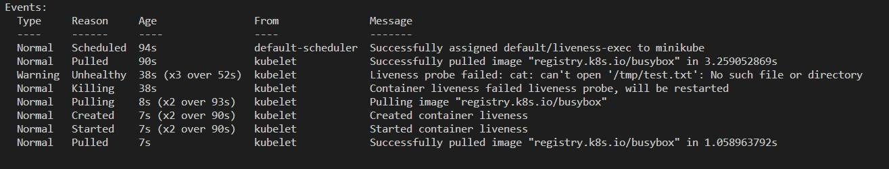

# Kubernetes pods
Pods are the smallest deployable units in the Kubernetes world. Although they can be created as singleton pods, they are usually created as part of a Deployment. While it is possible to create multi-container pods, one container per pod is the most common use case in the field.
The lifecycle of a pod starts when the kube-scheduler assigns the pod to a node. Then kubelets, which are agents present in every node, start coordinating the creation of pods. Within the lifecycle, the pods first go into the pending status and then transition into the running state if everything goes as planned. Finally, the pods are terminated either in success or in failure.
Once the pods are created, we want to make sure that they continue working smoothly. Kubernetes employs kubelets to ensure that pods are running in a healthy condition. The way, kubelet works is that it checks the desired state of a pod and compares it with the current state of that pod in terms of a PodSpec. 
Pods wrap containers and containers host applications. As long as the application needs running, we tend to keep containers running. Within the terms of a PodSpec we can define container restart policy based on our expectations. The default value of a container restart policy is set to `always` meaning that the Kubelet restarts the container in case of an exit notwithstanding the reason behind it. We can also set the restart policy to `Never`or `OnFailure`.
At first glance, this self-healing mechanism seems to solve problems in terms of container failures. However, it does not respond to one major problem. What if the container works fine but the application that is hosted in the container does not work properly?
This is where probes come handy as they offer us a way out of deadlocks in containerized applications by performing customized health checks within Kubernetes environments. Kubernetes offer three types of probes: Liveness, readiness, and startup probes. 
While readiness probe is used to assess when a container is ready to accept traffic, startup probe is used to understand when an application starts so that it puts liveness and readiness probes on hold until the application is fully started.

# Startup Probe
We can employ readiness and liveness probes for our containers but what if we have a container that hosts an application, such as a legacy application, which needs a considerable amount of time just to start up? In such a case, we do not have a faulty application, we just have a slow starting application. Employing a liveness probe would put it in a loop where the container is restarted before completing the start up process each time.
When a startup probe is configured, it disables liveness and readiness checks until the start up process succeeds, making sure those probes don't interfere with the application startup.

# Readiness Probe
Consider a scenario where you have a web application that has a frontend service deployed on five pods behind a load balancer. When you update your application, you will perform a rollout policy to make sure that you have five new pods with updated application. While the rollout policy is in effect, outdated pods will be terminated and updated pods will replace them. New pods will be added to the list that load balancer uses to direct the traffic. But if the pods are not completely ready, users will get error massages when they try to access your web application. 
The kubelet uses readiness probes to know when a container is ready to start accepting traffic. And a pod can be accepted as ready only after all of its containers are ready.

# Liveness probe
Kubernetes uses liveness probes to make sure that applications running in containers are fully operational. After a succefull initiation, applications may break down for so many reasons. In such cases, restarting the container provides an easy fix. Liveness probes invoke a restart when it detects an operational issue in a container. 

## Liveness probe example

In this section, I will demonstrate how liveness probe work by executing a liveness command

I will use minikube to create a cluster.


Executing a liveness command 

For this hands on, we will create a pod that runs a container based on the busybox image. We will use liveness.yaml file as the manifest file.

```bash
touch liveness.yaml
```

```yaml
apiVersion: v1
kind: Pod
metadata:
  labels:
    test: liveness
  name: liveness-exec
spec:
  containers:
  - name: liveness
    image: registry.k8s.io/busybox
    args:
    - /bin/sh
    - -c
    - touch /tmp/test.txt; sleep 36; rm -f /tmp/test.txt; sleep 600

    livenessProbe:
      exec:
        command:
        - cat
        - /tmp/test.txt

      initialDelaySeconds: 10

      periodSeconds: 7
```

# Explanation of the Manifest File:

As you can see, once the container is up, it will execute the following command 
```bash
touch /tmp/test.txt; sleep 36; rm -f /tmp/test.txt; sleep 600
```
It will create a file with the name `test.txt`. After 36 seconds, it will delete the file. (We are deleting the file just to demonstrate a problem in an application.)

Liveness probe, on the other hand, will execute the following command
```bash
cat /tmp/test.txt
```
The `initialDelaySeconds` reflects the initial time for the probe to start checking the pod. So, it will wait 10 seconds to start working which gives the pod enough time to be up and running.

`periodSeconds` on the other hand, reflects the time interval between each probe check. In other words, liveness probe will check the container every 7 seconds.

Now that we understand the manifest file, let's apply it.
```bash
kubectl apply -f liveness.yaml
```


Let's view the pod events
```bash
kubectl describe pod liveness-exec
```


As we can see, everything is normal. Kube-scheduler assigned the pod to minikube. Then, kubelet pulled the busybox image from registry.k8s.io and then created and started the container. 

But after, 38 seconds, liveness probe detected that the test.txt file is no longer there so it invoked the kubelet to restart the container.


We had set the initial period for 10 seconds. After 4 probe checks (4 * 7 seconds) of 28 seconds plus the initial 10 seonds, liveness probe detected the problem in 38 seconds. After the 3 probes of 21 seconds and 10 initial seconds (31 seconds) the container was still healty because we deleted the test.txt file after 36 seconds. Therefore, we detected the problem after 4 probe checks.

# Other Methods

We can also use HTTP requests and TCP sockets for employing liveness probes.

HTTP requests is used when we have a web application and we want to make sure that the application responds to requests.
We simply create a healthz path in the server and send requests to that path with a specific time interval. As long as the request returns a success code, the kubelet considers the container to be alive and healthy. However, if it returns a failure code instead, the kubelet immediately kills the container and restarts it.

Using a TCP socket is another way to employ a liveness probe. With this method, the kubelet will attempt to open a socket to your container on a specified port. As long as the connection is established, the container will be considered healthy. Of course, the lack of connection will point a failure and result in kubelet restarting the container.

If you want to try a hands-on experience on HTTP and TCP methods, you can refer to kubernetes documentation here. (https://kubernetes.io/docs/tasks/configure-pod-container/configure-liveness-readiness-startup-probes/)