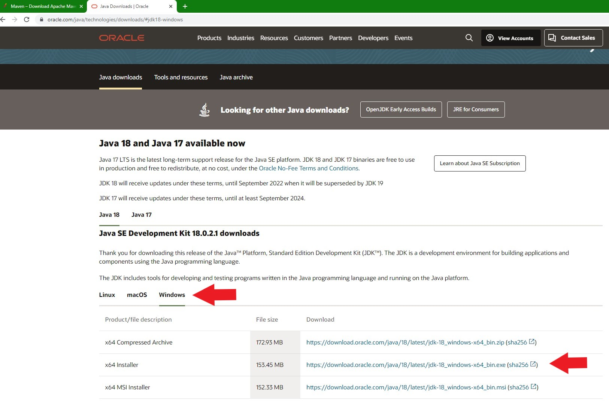
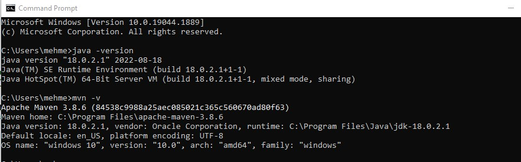

In this tutorial, I will guide you through installation of Apache Maven on a Windows PC.

1. Open a browser and type https://maven.apache.org/download.cgi


2. Check the system requirements to make sure that your computer meets them.


3. Maven require JDK 1.7 or above to execute so if you do not have JDK installed already, you must first install it.
If you are not sure whether you have JDK 1.7 you can check it using Command Prompt.

4. Click on the Windows icon on your keyboard and then type `cmd`to open Command Prompt


Than enter the following command to check Java Development Kit.

```bash
java -version
```
If you have JDK installed, you should see an output like this.


5. If you have JDK than skip through step 8. Otherwise open a browser and type `https://www.oracle.com/java/technologies/downloads/#jdk18-windows`to go to Oracle Website.

6. Choose Windows as OS and click on the link `x64 Installer`for 64 bit OS.


7. Once the download completes, extract the zip file to `C:\Program Files`.

8. Now go back to `https://maven.apache.org/download.cgi`

9. From the Files section, click on the `Binary zip archive`


10. Once the download completes, extract the zip file to `C:\Program Files`.

11. Now, we need to add both Maven and JDK to environmental variables list. Pres the Windows icon on your keyboard and enter `edit the system environment variables` and open it.


12. Click on `environmental variables`


13. Click on `New`


14. Enter a name for JDK and then enter the path to JDK. You can simply write it or find it by clicking on Browse Directory. Once you are done Click on OK to go back to the Environmental Variables menu.


15. Now from the System Variables list, find `Path`variable, select it and then click on `Edit`


16. Click on New and then enter the path to the Maven. You can also browse to it if you are unsure about the path. But you will most likely it as I have in the picture below.


17. Click on Ok until you close all the opened menus of Environmental variables.

18. Now open a fresh Command Promt screen and type `java -version`to check JDK and `mvn -v `to check Maven.



Congratulations. You have finished installing Apache Maven on your Windows Computer.


