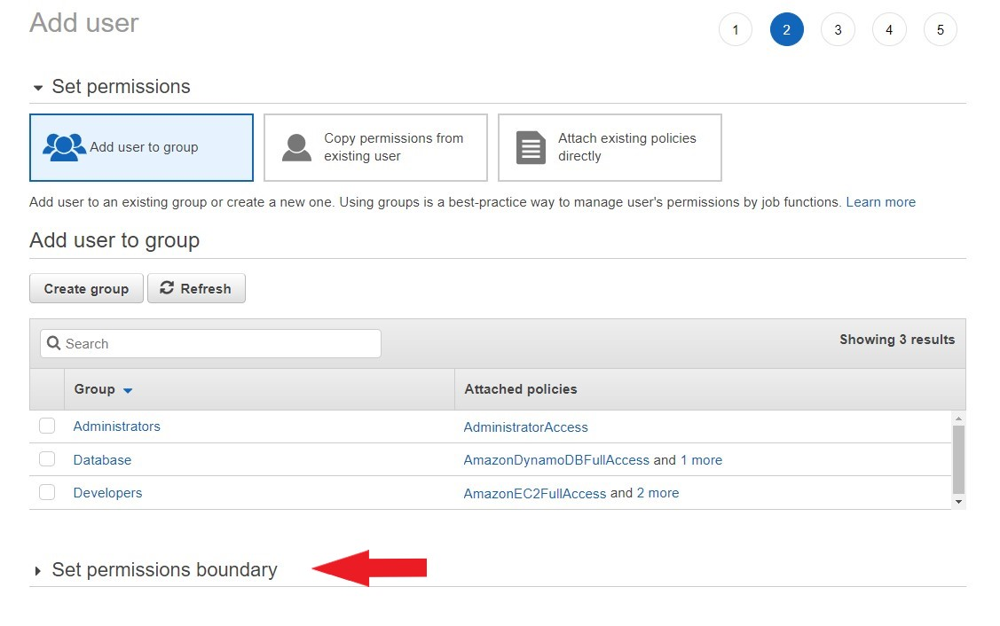
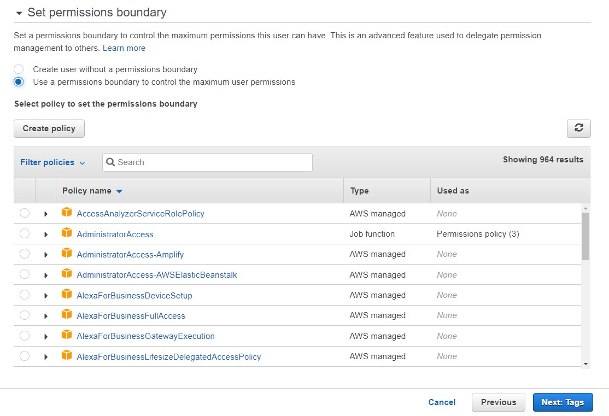

# AWS Permissions boundaries for IAM entities

When you sign up with AWS, you are presented with a multitude of services and a vast infrastructure at your disposal. If you are using AWS services just for yourself, things may be more straightforward. However, if you run a company and use AWS services or if you work for a company which uses AWS services then you should know know how to safeguard your AWS account.

AWS offers Identity Access and Management Service (IAM) where you can control how individuals or groups of people can use AWS resources. With this service, you can create users, groups, or roles for your organization.

While the root user account is by default the king of permissions, you need to explicitly provide permissions for every user in your organization. Because by default, AWS denies permissions for all users except the root user. AWS permits the creation of up to 5000 users per account.

Creating groups is the best way for attaching policies to users as the permissions are stated within policies. If you go by creating policies per individuals then you have to attach policies to each individual one by one. However, you can attach a policy to a group and all members of that group are automatically authorized.

What about boundaries?
Attaching policies and providing permissions for specific services sound great for security purposes. Right? You now know who can do what. Or…not?

Let’s check the below scenario:

You, as an admin, created a user “John” and provided him with only “IAM and S3” permissions. Therefore, John cannot launch new EC2 instances or terminate existing EC2 instances. Because he is not allowed to access EC2 resources. Is that good enough to stop John if he has bad intentions like launching new instances for mining coins? Well, the answer is unfortunately No.

What if John creates another user and yes he can do that because he has IAM permissions. By this way, he can provide the user he has created with Full Admin privileges and do whatever he desires. Bummer!

Well, AWS offers what they call Permissions boundaries to prevent such a scenario. By employing permissions boundaries, you can limit the number of permissions granted to users or groups.

You can find permissions boundary option when creating a new user on the IAM service. It is presented at the second step of creating a user. (First one is just naming the user and providing the access method for the user).

Just click on the permissions boundary at the bottom of the page.

Permissions boundary
You can then simply select “Use a permissions boundary to control the maximum user permissions” option and choose the permissions that you want the attach to the user.

Permissions boundary
The policies in “Permissions boundary” is no different than the policies in the regular policy section. They are written in the same Json format. However, they serve for different purposes.

When you create a permissions boundary, you limit the user. You can still attach other policies for other services to that user, but, if they are not in the permissions boundary” list, they will not mean anything to your user. They simply cant use them .

So permissions boundary is the actual list that presents the list of actions that a user can do notwithstanding the number of policies attached to the user.

