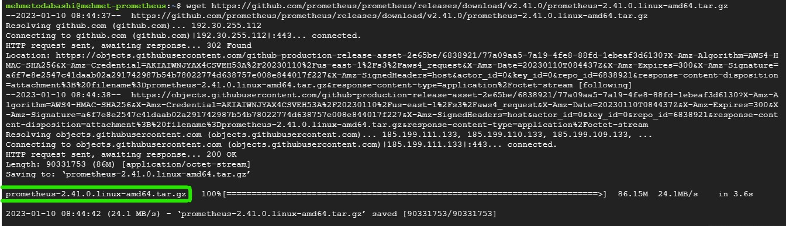
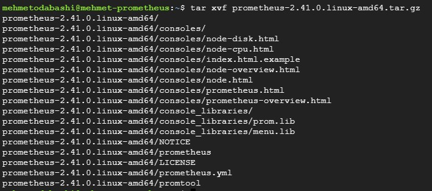
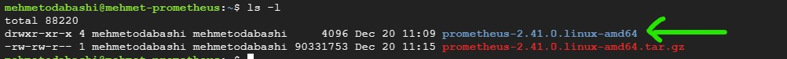

# Prometheus

Prometheus is an open source monitoring tool that collects numeric metrics and saves them as time series data in order to monitor your infrastructure. In this tutorial, I will guide you through installing Prometheus on an Ubuntu instance created by Google Cloud. You can use any virtual machine to follow along.

# Installing Prometheus

1. Go to https://prometheus.io/download/ to obtain the download link for Prometheus


2. First, update Ubuntu

```bash
sudo apt-get update
```


3. Use wget to download prometheus 

```bash
wget https://github.com/prometheus/prometheus/releases/download/v2.41.0/prometheus-2.41.0.illumos-amd64.tar.gz
```


4. Untar the downloaded tar file (extract it)

```bash
tar xvf prometheus-2.41.0.linux-amd64.tar.gz
```


5. Check the list of files and directories

```bash
ls -l
```


6. cd into the directory

```bash
cd prometheus-2.41.0.linux-amd64/
```
7. Start prometheus service
```bash
./prometheus
```


8. Do not close the terminal window unless you want to stop Prometheus

9. Go to your browser and check Prometheus

```bash
http://localhost:9090
```

10. If you are using cloud service like Google Cloud or AWS, you need to provide permissions for port 9090. You can do it by editing inbound rules for AWS and adding TCP 9090 from anywhere 0.0.0.0/0.
Since I am using Google Cloud for this project, I will add a firewall rule for port 9090


11. Then enter your public IP address followed by :9090

```bash
http://34.127.56.36:9090/
```


12. Enter `up` in the search field and click on `execute` to see the running systems. Even without managing scrap features, prometheus is scraping the instance it is running on. 


# Creating a systemd unit for Prometheus

As we installed and started Prometheus, it runs in the foreground. If we close the terminal it stops working. Also, it does not start once we boot up the instance. We have to manually start the executable file with `./prometheus`. However, we can overcome this issue by starting prometheus as we start many other services in Linux by using `systemctl` command.

1. Create a user for prometheus

```bash
sudo useradd prometheus --no-create-home --shell /bin/false
```
2. Create a folder for storing prometheus config file (prometheus.yaml)
```bash
sudo mkdir /etc/prometheus
```
3. Create a folder for storing prometheus data
```bash
sudo mkdir /var/lib/prometheus
```
4. Update the permissions for these folders so that they are owned by prometheus user and group.
```bash
sudo chown prometheus:prometheus /etc/prometheus
sudo chown prometheus:prometheus /var/lib/prometheus
```
5. Copy the prometheus executable to /usr/local/bin where Linux keeps locally installed executable files (Be sure that you are in the prometheus-2.41.0.linux-amd64 directory or use correct path)

```bash
sudo cp prometheus /usr/local/bin
```
6. Copy the promtool as well.

```bash
sudo cp promtool /usr/local/bin
```
7. Update the permissions on the copied files

```bash
sudo chown prometheus:prometheus /usr/local/bin/prometheus
sudo chown prometheus:prometheus /usr/local/bin/promtool
```

8. Copy the console and console_libraries to /etc/prometheus

```bash
sudo cp -r consoles /etc/prometheus
sudo cp -r console_libraries /etc/prometheus
```

9. Update the permissions on the copied files

```bash
sudo chown -R prometheus:prometheus /etc/prometheus/consoles
sudo chown -R prometheus:prometheus /etc/prometheus/console_libraries
```

10. Now, copy the configuration file to /etc/prometheus

```bash
sudo cp prometheus.yml /etc/prometheus/prometheus.yml
```
11. Change the permissions as well

```bash
sudo chown prometheus:prometheus /etc/prometheus/prometheus.yml
```
12. Now we will create a unit service file

```bash
sudo vi /etc/systemd/system/prometheus.service
```


```bash
[Unit]
Description=Prometheus
Wants=network-online.target
After=network-online.target

[Service]
User=prometheus
Group=prometheus
Type=simple
ExecStart=/usr/local/bin/prometheus \
    --config.file /etc/prometheus/prometheus.yml \
    --storage.tsdb.path /var/lib/prometheus \
    --web.console.templates=/etc/prometheus/consoled \
    --web.console.libraries=/etc/prometheus/console_libraries

[Install]
WantedBy=multi-user.target
```
Hit `esc :wq` to save and exit

13.  Reload the system daemon
```bash
sudo systemctl daemon-reload
```
14. Now, we can start prometheus as a service

```bash
sudo systemctl start prometheus
```
15. Let's check and make sure that it is running

```bash
sudo systemctl status prometheus
```


16. In order to ensure Prometheus works after each boot up, we need to enable prometheus

```bash
sudo systemctl enable prometheus
```


Well! Thats all folks. We have installed Prometheus in two different ways. I hope this story helped you through the installation process.