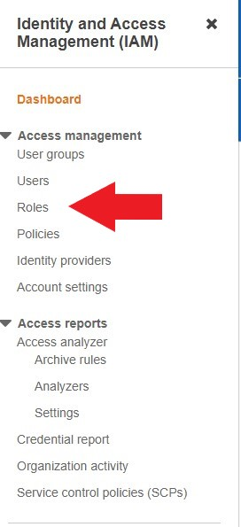

# Terraform Installation 

In this tutorial, I will show you how to install Terraform on a EC2 instance and configure AWS CLI in order to execute Terraform commands.

## Terraform Installation on a EC2 instance

1. First you need to spin up an instance on the AWS Console.


2. Select the instance and click on connect


3. Choose the SSH client tab (third tab) and then copy the ssh-i connection denoted as example.


4. Open VS Code and start a new terminal. Make sure that you are in the same directory with your .pem key and insert the copied ssh -i connection.

```bash
ssh -i "yourkey.pem" ec2-user@ec2-52-87-111-121.compute-1.amazonaws.com
```
5. Enter yes when promted and if you can see the EC2 image as below, then you are in the EC2 console.


6. First things first. Update the Linux instance.

```bash
sudo yum update -y 
```

7. Once you are done, you will se update completed output.


8. Install Amazon utils

```bash
sudo yum install -y yum-utils
```

9. Add hashicorp repo
```bash
 sudo yum-config-manager --add-repo https://rpm.releases.hashicorp.com/AmazonLinux/hashicorp.repo
 ```


10. Now the environment is set, you can install terraform

```bash
sudo yum -y install terraform
```

11. Finally check to see that it is installed properly.
```bash
terraform --version
```
You should see a screen like this:


## Using Terraform on AWS CLI

There are two methods for using the AWS CLI for performing Terraform commands.

### Secure Way

Now we SSH 'ed our way into an instance, the most secure way tu perform Terraform commands is to create a role in IAM service for this particular EC2 and attach policies so that the EC2 can reach out other AWS services, such as S3 buckets.

1. Go to the Console and open IAM service.


2. Click on Roles on the left hand side of the page


3. Click on Crteate Role


4. Select EC2 as use case and then click next.


5. For this tutorial I will create an EC2 instance and a S3 bucket so we need to find related policies and attach those policies to our instance. In the policy search bar write EC2 and hit enter. Then choose EC2FullAccess Policy by putting a tick mark on the left.


6. Clear the filters under search bar and write S3 this time and hit enter. Choose S3 Full Access Policy by putting a tick mark on the left. Then click next.


7. Give your role a name.


8. Review the page to see that the EC2FullAccess and S3FullAccess roles are attached. If so, click on create role.


9. Go to the EC2 service and find your instance.


10. Choose the instance by putting a tick mark on the left, then clik on actions, select Security and finally hit on Modify IAM Role.


11. Choose the role we specified from the dropdown menu and click on update IAM role.


You are all set. Now you can go back to the terminal and perform terraform commands that will help you create EC2 isntances and S3 buckets. For more resources, you need to attach related policies.

### Classic Way

The classic way to use AWS CLI is to employ AWS credentials by using the AWS configure command on terminal.

```bash
aws configure
```

You then need to enter your Access Key ID, Secret access key, region (like us-east-1) and default output format (json or yaml)