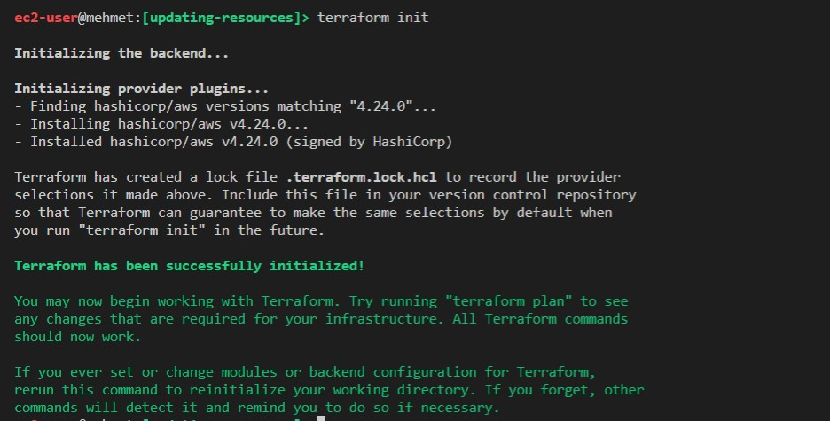
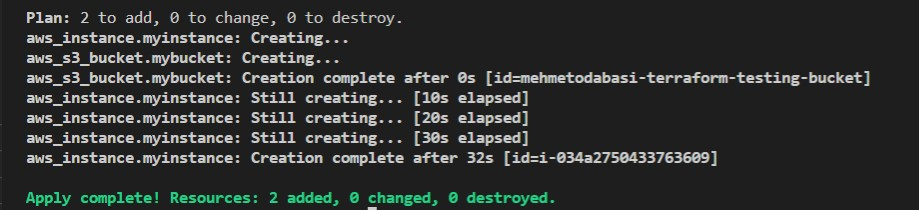
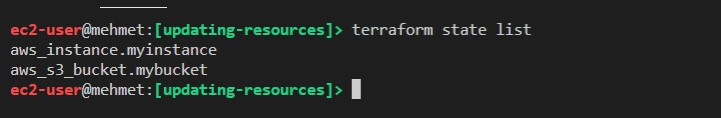
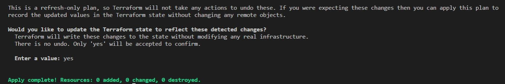
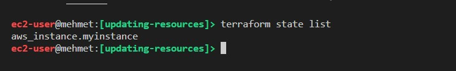
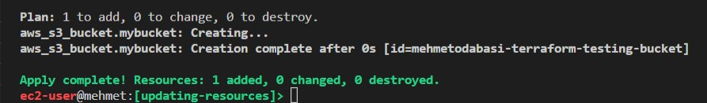
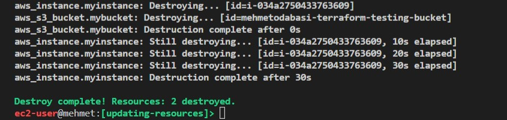

# How to synchronize Terraform state file with manually changed resources

When you prepare your code using Terraform and create the resources by performing a terraform apply command, you take advantage of automation. Terraform automatically creates a state file in which your newly created resoures are listed in great detail.

Whenever you make a change in the configure file and apply the changes by performing terraform apply command, the state file is updated by Terraform as well. So everything seems perfect.

What if you somehow go and manually modify a resource, say delete an S3 bucket, how does Terraform react to this situation. Now you have a state file with a specif configuration however your actual resources differ from the ones in the state file.

Terraform has a solution for such situations. I included a hands-on study below to demonstrate how you can fix this issue by using Terraform commands.

# Hands on study

## Part 1 Creating resources

1. Create a new folder, cd into the folder, and create the configuration file inside the folder.

```bash
mkdir updating-resources && cd updating-resources && touch update.tf
```

2. Edit the update.tf with an editor.

```bash
vim update.tf
```

3. Add provider information for AWS.

! [provider_info](provider.jpg)

4. Add two resource blocks. On for an EC2 instance and one for an S3 bucket.

! [resources](resources.jpg)

5. Now your file should look like this.

! [final](tf_file.jpg)

6. Press `esc` and then enter `:wq` to save and exit the vim editor.

7. We will first need to initialize the backend.

```bash
terraform init
```



7. Since we are happy with the configuration file, we skip the terraform plan option and we directly perform terraform apply command to start creating our resources. We will also use the -auto-approve flag to skip the confirmation part where we have to enter `yes` to continue.

```bash
terraform apply  -auto-approve 
```

8. Now we have two resources created by Terraform.



9. Let's see our list of resources with terraform list command.

```bash
terraform state list
```



## Part 2 Modifying resources in Real World

1. Let's go to the AWS console and log into S3 service to see our bucket.

! [bucket_list](bucket_list.jpg)

2. Choose your bucket and click on delete. You will see a screen like this.

! [delete](delete_bucket.jpg)

3. Confirm deletion by entering the name of the bucket in the text input field and hit delete bucket.

4. Check your bucket list to see that your bucket no longer exists.

! [new_bucket_list](new_list.jpg)

## Part 3 Refreshing the state file

1. Go back to the terminal and check your resources again

```bash
terraform state list
```


2. In the real world, we deleted the S3 bucket, however, our state file still shows the S3bucket. Lets's correct this issue with terraform refresh command

```bash
terraform apply -refresh-only
```
3. Terraform will check the plan, find the differences with the plan and the real world infrastructure and will ask you to confirm (with a yes) in order to update the state file to reflect the detected changes. Just confirm and hit enter.

4. Now you will see that the apply is complete with no changes to infrastructure (s3 bucket already deleted).



5. Let's check the state list again.
```bash
terraform state list
```



As you can see, the state file only list the EC2 instance which reflects the real world infrastructure.

6. If you want to create the S3 bucket again, just run the terraform apply command. Our state has changed but the configuration file still has S3 as a resource.

```bash
terraform apply -auto-approve
```
7. Now you can see that Terraform only created one resource which is the S3 bucket.



Congratulations. You have successfully updated your state file and created the resources again.

Do not forget to clean up your resources.

```bash
terraform destroy
```

