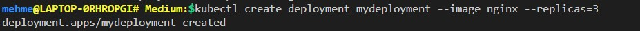
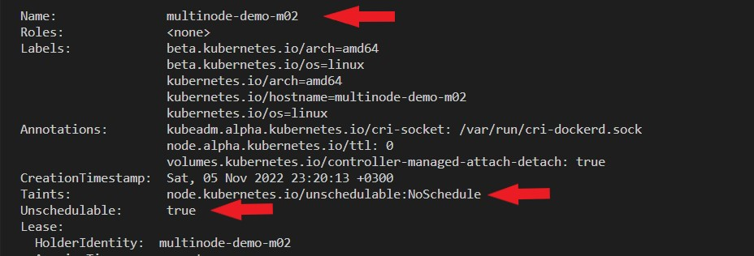

# Administrating Kubernetes Clusters: How to drain and cordon nodes

When you administer a Kubernetes cluster,there will be times when you need to temporarily keep a node out of use for several reasons, such as maintenance purposes.
But what happens to the applications in those nodes? If the applications work on pods that are part of a replicaset, they will be terminated in the current node and recreated in one of the other nodes. However, if not you will have to take care of the pods manually.
Now that you know this, how will you get rid of all the pods in the current node and make sure that no new pod will be scheduled. In other words, how can you evict pods from a certain node and make it unschedulable? The answer is to drain the node to ensure the eviction of pods.
When you a drain a node, the pods on the node are evicted except for the daemon-sets. If you want to evict the daemonsets you need to specify it explicitly with the --ignore-daemonsets key. Once the node is drained, it also becomes cordoned. Cordon means that a node is unschedulable, therefore, will not accept new pods.
What if you do not want to drain a node and just make itt unschedulable? Then without running the drain command, you can simply run cordon command. The existing pods will stay and no more pods will be scheduled. To reverse the process, you can run uncordon command.

Let's see how drain, cordon, and uncordon works with a hands-on study. 

# Kubernetes Cluster

You can set up a Kubernetes cluster of your choice. I will use minikube with two nodes.
```bash
minikube start --nodes 2 -p multinode-demo 
```


Let's check the nodes
```bash
kubectl get nodes 
```


When we cordon a node, we want to be able to schedule the pods in the other node. So we want to make sure that the nodes are not tainted.


Now, that we have two nodes and they are not tainted, we can start deploying applications.

First, we will create a single pod running nginx.

```bash
kubectl run single-pod --image=nginx
```


```bash
kubectl describe pod single-pod
```


Now, let's create a deployment with the same nginx image and set the replicas to 3

```bash
kubectl create deployment mydeployment --image nginx --replicas=3
```


Now, let's check the pods to see the nodes they are scheduled on.


As we can see, the single pod and two of the three pods of the deployment are working on multinode-demo-m02.

# Drain a Node

We decided to drain multinode-demo-m02 for maintenance purposes. Before the maintenance, we want to make sure that there are no pods running on the node.

```bash
kubectl drain multinode-demo-m02
```


When you drain a node that has pods which are managed by ReplicationController, ReplicaSet, Job, DaemonSet, or StatefulSet, those pods will be recreated by the respective controller. However, singleton pods are not recreated when they are terminated. Therefore, when you try to drain a node that has such a node, you will get an error message. It is just for warning purposes;however,to execute the drain operation, you will need to use --force option. 

Also, another error message will pop up due to daemon-sets. Daemon-sets normally run on all nodes so we need to use --ignore-daemonsets to ignore the error message and delete them.

Note that despite the errors, the multinode-demo-m02 node is cordoned.

Now, let's try to drain again using ignore and force flags.

```bash
kubectl drain multinode-demo-m02 --ignore-daemonsets --force
```


As you see, we have succesfully drained multinode-demo-m02.

What happened to the applications?

As you remember, we had a deployment object with three pods and a single pod working on the two nodes. When we drained the node, we evicted the single pod and the two pods out of three pods of the deployment object.

Let's check the pods to see what happened


The replicaSet controller ensured that the two evicted pods are recreated in the other node. But we lost the single pod because we had to manage it manually.

How to check the Cordon Status of the nodes?

We can simply run the `kubectl describe nodes` command


As you can see Unschedulable is set to True for multinode-demo-m02 node. 

# Uncordon a node

We are done with the maintenance of the multinode-demo-m02 node and we want to use it again. Now, all we have to do is to run the uncordon command.

```bash
kubectl uncordon multinode-demo-m02
```


Let's run the `kubectl describe nodes` command again to make sure that unschedulable is set to False this time.


# Cordon a node

In order to mark a node as unschedulable, we do not have to drain it first. We may want to hold on to the current pods and no longer accept new pods to the node.

To see how this works, let's create a new pod first.

```bash
kubectl run new-pod --image=nginx
```


As you can see the new-pod is created on multinode-demo-m02 node.

Let's make sure that multinode-demo-m02 no longer accepts new pods.

```bash
kubectl cordon multinode-demo-m02
```


Let's run the `kubectl describe nodes` command again to make sure that unschedulable is set to True again.



Now that we have seen the multinode-demo-m02 node as unschedulable, let's check the pods to see that the newpod is not evicted and still in a running state.

```bash
kubectl get pods -o wide
```


Yes, it is there!

You can try to create new pods and deployments and see that they will only be deployed on the multinode-demo node. 

I hope this hands-on helped you understand how drain, cordon, and uncordon works!


Stay tuned!