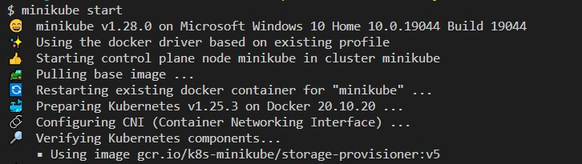
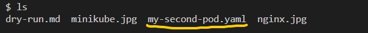
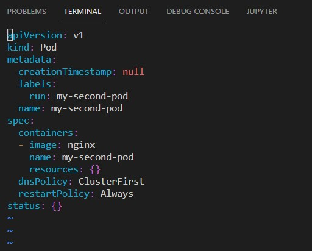
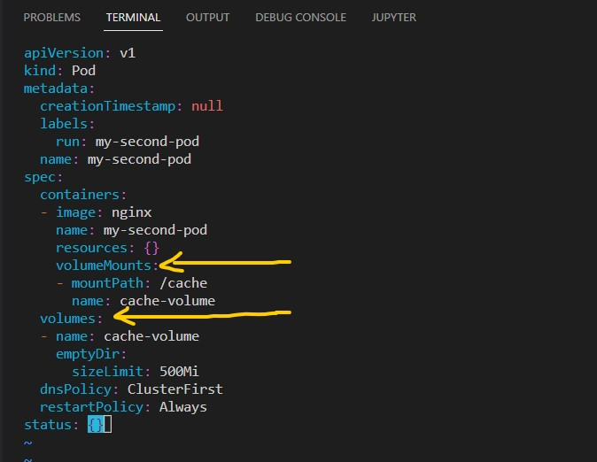
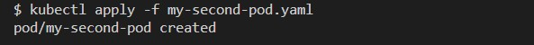
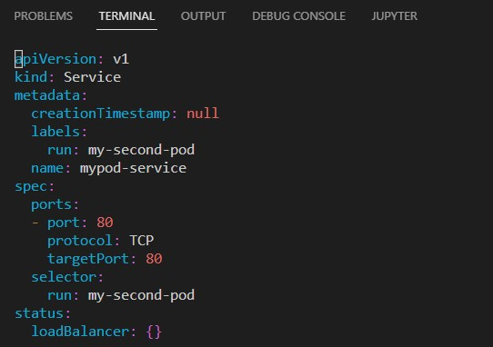
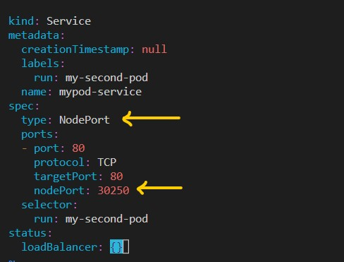

In Kubernetes, we can create objects either in a declarative or an imperative way. Although using the imperative methods speeds up the process, the declarative method helps us keep a record of what we have been doing inside the cluster. In addition to that, declarative method makes it easier for replication of the object creation process.
You can find more information between the two methods in my medium story [HERE](https://medium.com/@mehmetodabashi/kubernetes-pods-imperative-and-declarative-methods-ead520385b34) 

So we are planning to create objects and we decided to use the declarative method and now what? Well, we will need a yaml file. 

And how are we going to get a template for the yaml file? We can use existing templates if we have a repo of our own or we can find templates from the Internet, particularly from the Kubernetes documentation.

Well, there is a third way and with this third way we do not need to search the net: Using dry-run method.

With the dry-run, we can use an imperative command and turn it into a declarative one. This is also very helpful in situations where we need to enter additional spec when creating objects which otherwise can be created with a simple imperative command.

Let's see how it works in action.

I will use minikube as it is extremely convenient.



Let's start with creating a pod with nginx image. We can normally run a simple imperative command

```bash
kubectl run my-pod --image=nginx
```
But, what if we need to add volume? In such cases, we simply create a yaml file where we can play with the specs and the best way to to it is to employ dry-run.

Let's create another pod and use dry-run this time.

```bash
kubectl run my-second-pod --image=nginx --dry-run=client -o yaml >my-second-pod.yaml
```
When you run this command, you are not actually creating a pod. You just do a rehearsal. If you run an ls command you will see that a yaml file is created.


The first part of the command `kubectl run my-second-pod --image=nginx`is the normal pod creation command. With `--dry-run=client`you let the bash know that the command will not be actually executed. `-o yaml`points out that the output will be formatted as a yaml file and finally `> my-second-pod.yaml`we redirect the output to a yaml file with the name `my-second-pod.yaml`.

Let's check the yaml file with vim editor.

```bash
vim my-second-pod.yaml
```
As you can see we now have a nice yaml template for creating a pod object.



Now, we can add volume and volumemounts easily by editing the yaml file.



Once we are done we just need apply the yaml file.

```bash
kubectl apply -f my-second-pod.yaml
```



We can use dry-run for many situations. For example you want to create a service so that you can expose the pod you just created. You can write a simple expose command with dry-run and then edit the yaml file as you wish.

```bash
kubectl expose pod my-second-pod --name=mypod-service --port=80 --dry-run=client -o yaml > mypod-service.yaml
```
The logic is the same. First part is the command where you expose the pod, provide a name for the service, and provide the port number. Then you get the output as a yaml file and employ dry-run. The last part is where you redirect the output to a yaml file.

All you have to do is to use an editor like vim or nano to edit the file.



As you can remember, we did not specify the type of service when we first used the command before the dry-run part. By default the service will be of ClusterIp type. However, we can edit the yaml file and make the service a NodePort service.



Then just apply the yaml file.

```bash
kubectl apply -f mypod-service.yaml
```


