In Unix like operating systems, ETC folder is used to keep configuration data. Similarly,Kubernetes uses ETCD for keeping configuration data as well as cluster information. the name ETCD comes from the ETC folder with an addition of the letter D which stands for distributed systems.

ETCD is the key value data store of the Kubernetes Cluster. The data is stored for service discovery and cluster management. It is important to take a back up of the ETCD as a measure against failures.
In order to interact with etcd, in terms of back up and restore purposes, we will utilize a command line tool:etcdctl

etcdctl has a snapshot option which makes it relatively easy to take a back up of the cluster. In the next section, I will show you how to back up an etcd cluster by using the etcdctl snapshot option.

So, let's get to it.

# Back up etcd cluster

1. First of all we need to make sure that we have the etcdctl installed.
```bash
etcdctl version
```

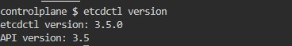

If etcdctl is installed, you will see an output like the one above, if not it will give a `command not found `error. 
2. You can skip this step if you have a working etcdctl. If not you can install etcdctl by following the steps provided in this url.(https://github.com/etcd-io/etcd/releases). You can find installation guide for Linux, MacOS, and Docker.

3. Now that we have etcdctl command line tool, we can start taking a snapshot of the current state of the cluster. However, in order to do that, we need to obtain some information from the etc.

First, we need information regarding the endpoints. If we have the etcd running in the same server, then we can simply add --endpoints=https://127.0.0.1:2379, 127.0.0.1 being the localhost ip and 2379 being the official port number of etcd. If the etcd is running on another server, then we need to change the localhost ip with the ip of that server.
Secondly, we need certificates to authenticate to the ETCD server to take the backup. The certificates that are required are --cert, --cacert and --key.

4. How do we get the endpoint and the certificate information?
Well, we can retrieve them from the etcd pod and the manifest file for etcd pod is located under /etc/kubernetes/manifests folder


We can retrive information regarding the endpoints with the following command:
```bash
cat /etc/kubernetes/manifests/etcd.yaml | grep listen
```
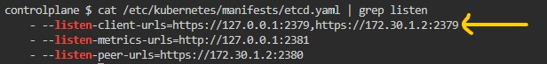

Just check the --listen-client-urls.

On the other hand, we can get the certificate information with the following command.

```bash
cat /etc/kubernetes/manifests/etcd.yaml | grep file
```

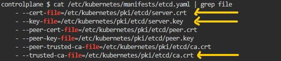

5. Once we have the necessary information, we can run the snapshot save command using etcdctl.

```bash
ETCDCTL_API=3 etcdctl --endpoints=https://127.0.0.1:2379 \
--cacert=/etc/kubernetes/pki/etcd/ca.crt \
--cert=/etc/kubernetes/pki/etcd/server.crt \
--key=/etc/kubernetes/pki/etcd/server.key \
snapshot save <backup-file-location>
```

6. One thing to note here is that we need to place ETCDCTL_API=3 at the beginning of the command .The API version used by etcdctl to speak to etcd may be set to version 2 or 3 via the ETCDCTL_API environment variable. However, we need to make sure it is default to the v3 API in order to take a snapshot. 
If you do not want to enter that information each time you enter a command, you can Set environment variable ETCDCTL_API=3 with the following command.
```bash
export ETCDCTL_API=3
```
7. Let's run the snapshot save command and save the snapshot as `etcd-backup.db`

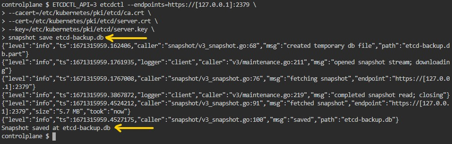

Well done! We now have a back up of the etcd! (Note the last line of the output "snapshot saved at etcd-backup.db which indicates successful snapshot save process)

# Restoring etcd from the snapshot
The first two steps are not part pf the restore process. However, I present them to make it easier to understand the transition between the current etcd and the restored etcd.
1. Let's take a look at the pods in the default namespace. As you have seen through the back-up process, I did not create any pods. And when I run the get pods command, I will have no resources.


2. The snapshot we took has all the current data from the cluster. Now we will create a new pod just to see that it will not be there once we restore the etcd from the snapshot, because the snapshot we took does not have this particular pod or any other pods in the default namespace. 

```bash
$ kubectl run newpod --image=nginx
```

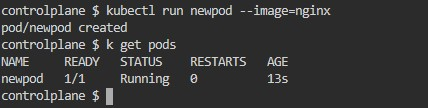

3. Now, we can move on to actually restoring etcd. Imagine that etcd somehow failed and we need to revert it to the last saved state. We know that we have a etcd-backup.db which we saved earlier. 

4. When we use etcdctl to restore the saved snapshot, we use almost the same command and certifite files as we used when took a snapshot of the etcd. But this time, we need to provide a new data directory where we will keep the etcd data from the etcd-backup.db database.

```bash
ETCDCTL_API=3 etcdctl --data-dir="/var/lib/etcd-backup" \
--endpoints=127.0.0.1:2379 \
--cacert=/etc/kubernetes/pki/etcd/ca.crt \
--cert=/etc/kubernetes/pki/etcd/server.crt \
--key=/etc/kubernetes/pki/etcd/server.key \
snapshot restore etcd-backup.db
```
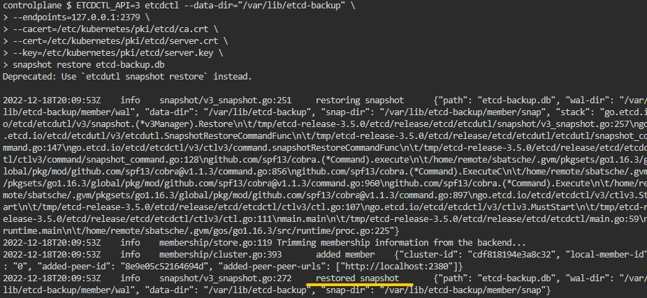  

5. We created a new directory and moved the back-up data in that directory. However, we have not changed the etcd cluster yet. If you check the pods, you will see that we still have the `newpod`there which is not part of the back up process.

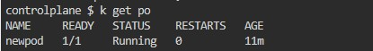

6. As you know, kubernetes keeps manifest of static pods in the /etc/kubernetes/manifests folder. etcd.yaml which is the manifest file for the etcd pod is also there. We need to edit that file and make sure that it uses the new restored data directory as mountpath instead of the old one.

```bash
vi /etc/kubernetes/manifests/etcd.yaml
```

Change the following parts in the etcd.yaml

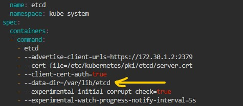

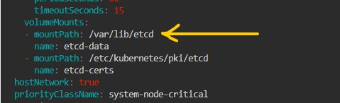

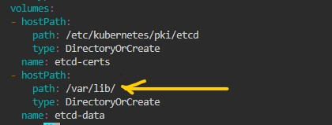

This is how etcd.yaml will look like after changes

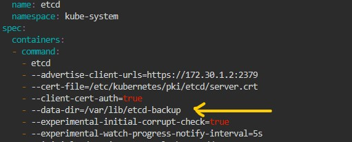

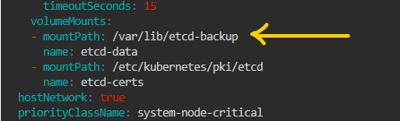

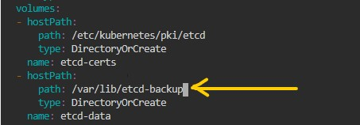

7. At this point, you will need to wait couple minutes for the etcd pod to start with the new state. Meanwhile you will not be able to get response from the apiserver.

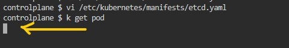

8. Let's verify that we restored the snapshot successfully by checking the pods in the default namespace. As you can remember we took the snapshot with no pods but then we created a pod with the name of newpod. If newpod is still here then we failed to restore from the backup. If there is no pod in the dault namespace then we succesfully restored from the back up.

```bash
kubectl get pods
```
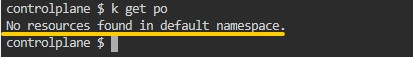

Horray! We made it! 