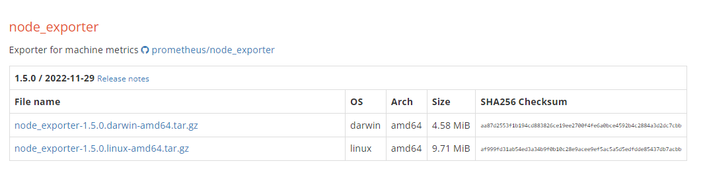
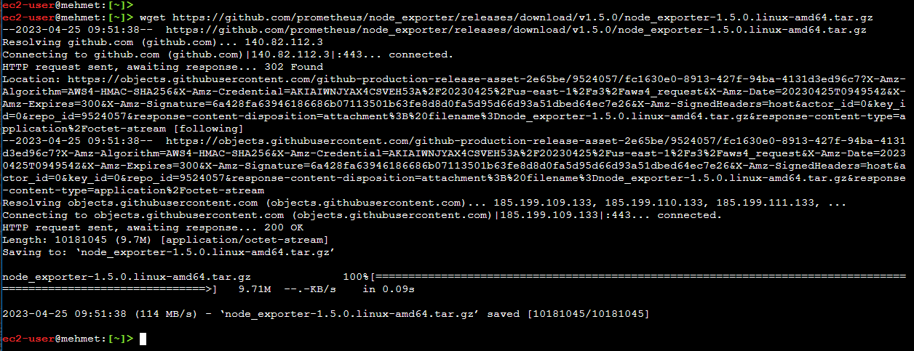
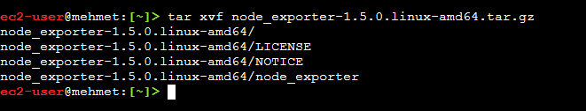
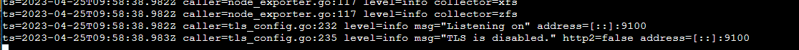
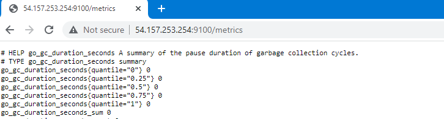
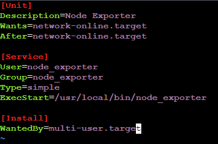
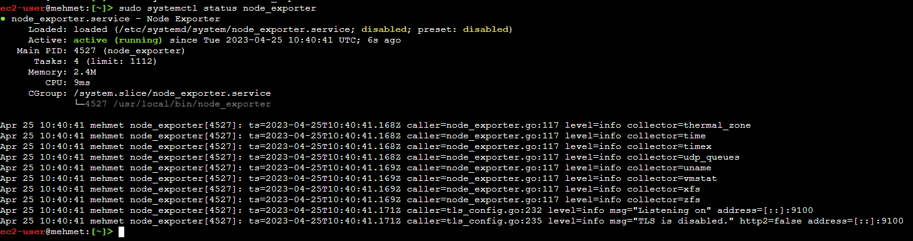

# Node Exporter
Node Exporter is a Prometheus exporter that collects various system-level metrics from a Linux/Unix server. These metrics include CPU usage, disk usage, memory usage, network traffic, and many others.

Node Exporter is a very important component of Prometheus monitoring, as it enables the collection of server-level metrics that are crucial for understanding the health and performance of a system. Without Node Exporter, it would be difficult to collect detailed information about the resource usage and behavior of individual servers in a distributed system.

In this guide, we will eplore two methods to install node exporter on a Linux host.

## Default Method

First, we will install node exporter in the default way.

1. Go to http://prometheus.io/download and copy node exporter download link



2. Use wget command to download the node exporter

```bash
wget https://github.com/prometheus/node_exporter/releases/download/v1.5.0/node_exporter-1.5.0.linux-amd64.tar.gz
```


3. Untar the tar file

```bash
tar xvf node_exporter-1.5.0.linux-amd64.tar.gz
```


4. Go into the node exporter directory

```bash
cd node_exporter-1.5.0.linux-amd64/
```

5. Start the process by running the executable file

```bash
./node_exporter
```

From the output, you will see that the node exporter is listening to port 9100.



6. Now, let's check to make sure that node exporter is working properly.

* You can open a new terminal window and run `curl localhost:9100/metrics`
* I am on a AWS EC2 instance so I will open a new browser and check PublicIP:/9100/metrics



# Systemd method

As we installed and started node exporter, it runs in the foreground. If we close the terminal it stops working. Also, it does not start once we boot up the instance. We have to manually start the executable file with `./node_exporter` command. However, we can overcome this issue by starting node exporter as a service as we start many other services in Linux by using `systemctl` command.

1. Copy node exporter binary files to /usr/local/bin directory

```bash
sudo cp node_exporter /usr/local/bin
```
2. Create a user for node exporter.

```bash
sudo useradd node_exporter --no-create-home --shell /bin/false
```

3. Change permissions for node exporter executable file.
```bash
sudo chown node_exporter:node_exporter /usr/local/bin/node_exporter
```

3. Create a service file

```bash
sudo vi /etc/system/systemd/node_exporter.service
```
Note: If you are using Amazon Linux 2 then you should use  `/etc/systemd/system/node_exporter.service` as path
4. Add the following content to service file

```yaml
[Unit]
Description=Node Exporter
Wants=network-online.target
After=network-online.target

[Service]
User=node_exporter
Group=node_exporter
Type=simple
ExecStart=/usr/local/bin/node_exporter
    
[Install]
WantedBy=multi-user.target
```



5. Reload the system daemon

```bash
sudo systemctl daemon-reload
```

6. Now, we can start and enable node exporter as a service

```bash
sudo systemctl start node_exporter
sudo systemctl enable node_exporter
```
7. Let's check the status of our node exporter service

```bash
sudo systemctl status node_exporter
```



Node_exporter service is active and running. Well done!