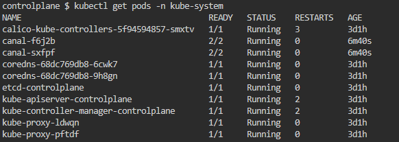

When we work with Kubernetes, we generally take most of the processes granted thanks to the Kubernetes architecture. Placing pods in a suitable node is one of those processes. Either we run an imperative `kubectl run` command or we simply provide a deployment or replciaset yaml file and then we sit back and wait the pods to be placed in the nods within the cluster. However, it is crucial to understand how things work under the hood. In fact, it is imperative to know how you can schedule the pods manually within the cluster, so that you can do a manual scheduling should you need it in the future.

# Kube-scheduler

Kube-scheduler is the component that schedules pods to nodes within the cluster. In doing that, kube-scheduler takes into account parameters, such as the available resources on each node, the required resources of the pod, the affinity and anti-affinity rules, the node taints and tolerations, the pod priority and preemption policies, and many other factors. Based on these parameters, kube-scheduler decides which node in the cluster is the best fit for the pod and assigns it to that node.

When we prepare a yaml manifest file for a pod, we generally omit a field called nodeName. During the pod creation, kube-scheduler scans through all the pods and checks this field. If the field is empty, the kube-scheduler assigns the pod to a suitable node and the field name gets the value. In other words, if we do not add the nodeName field, Kubernetes adds it for us once the pod is created and scheduled by the kube-scheduler.

# What if there is no kube-scheduler
What happens when there is no kube-scheduler working or the kube-scheduler is not working properly? Let's see this in action.

In order to see whether the kube-scheduler is working or not, we can simply check the kube-scheduler pod in the kube-system namespace.
```bash
kubectl get pods -n kube-system
```


As you can see, the kube-scheduler is working. Let's remove the kube-scheduler pod  manifest file and check again.

```bash
mv /etc/kubernetes/manifests/kube-scheduler.yaml kube-scheduler
kubectl get pods -n kube-system
```



Now, there is no kube-scheduler to schedule the pods. Let's create a test pod with a simple nginx image and see what will happen.

```bash
kubectl run testpod --image=nginx
kubectl get pods -o wide
```


Without kube-scheduler working, the pod is stuck in a pending status.

# Manual Intervention

When the kube-scheduler is not working, manual intervention can place the pod in a node. How to do that? I actually gave a hint at the beginninng. All we have to do is to add a nodeName field in the manifest file and add a suitable node manually. 


As youc an see, we added node01 as the nodeName and saved the yaml file. Now, let's run the kubectl apply command to create the pod and see what happens.

```bash
kubectl apply -f test2.yaml
kubectl get pods -o wide
```


Well, we managed to schedule the pod to node01 without using the kube-scheduler. But we still have the first pod in a pending status! Let's work on that pod!
Can we simply edit the pod manifest file, add a nodeName field and apply it directly? The answer is no. We can only add a nodeName during the creation of the pod and we had already created the pod without a nodeName. What can we do?

First of all, we can always delete the pod and then edit the manifest file by adding a nodeName and then recreate the pod. If we do not want to delete the pod, then we can edit the manifest file by adding a nodeName field and then use `replace`and `force`commands. Let's do that.

1. First, we run the following command to access pod manifest file (The manifest file will have more fields than a usual manifest file but it is normal, just go ahead).

```bash
kubectl edit pod testpod
```
2. Add nodeName field under spec and enter a node.


3. Save and exit the manifest file (`:wq`). 


4. You will get an error message saying that the edit was cancelled because you can not normally edit pod manifest files. But, the output will also provide a new file path under tmp directory that has the edited manifest file. Think of it as if you saved as the manifest file with a new name and location. Copy that file path.

5. Run the following command to replace the pod manifest file. and add the file location you just copied.

```bash
kubectl replace --force -f /tmp/path-to-new-manifest-file-copied-above
```


6. Let's get the pods to see whether we could assign the pod to a node

```bash
kubectl get pods -o wide
```


Good job! We did it. Both pods are assigned to nodes.

Important note: If you had created the pod with a manifest file, you do not need to enter `kubectl edit`command, you can directly edit the manifest file with an editor ,such as vim. But, you still have to run the `kubectl replace --force` command to make the changes.
