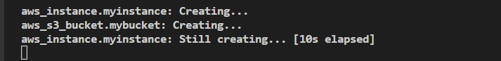

# How to create AWS resources with Terraform 

When you dive into the AWS world, you are amazed by the multitude of resources AWS offer including computing, database, or storage solutions. You want to sping up EC2 instances, create databases, or deploy applications. You get to learn various services and then you wonder whether there is a way to accomplish all of these actions with automation. Then you come to realize the power of Cloudformation as an Infrastructure as a Code service and you become very happy to be able to use stacks for creating your resources.

Then you start wondering about other cloud providers. What if you want to user other cloud providers and want to create resources with a code just like you do with AWS Cloudformation. Well, Terraform is your answer. It is an Infrastructure as a Code Service which is basically cloud agnostic. So you can use Terraform to easily create resources by hundreds of providers.

If you want to stick with AWS, just like me, Terraform still winks at you. Because Terraform provides an easy to follow structure to create AWS resources. 
In this tutorial, I will spin up an EC2 instance and create an S3 bucket by using Terraform. If you follow along, you will be able to learn the basics of Terraform and how it applies to the real world.

# Prerequisites

1. In order to use Terraform, you need to have it  installed on your system. (If you have not done it before, you can read my medium story on How To Install Terraform by clicking here.)

2. You need to have your AWS credentials configured. (If you have not done it before, you can you can read my medium story on How To Install Terraform by clicking here.) 

# Basic Terraform Concepts and Commands

## Terraform State

When you start using terraform you need to create a configuration file with your resources (We will do it in the next section). This configuration file includes both the provider information, such as AWS and Github and the resources they offer.

As soon as you initialize terraform, it creates a state file in which the current configuration of resources and providers are stored. The state file is actually a detailed list of all the resources that were coded in the configuration file. 
Any time you make a change in the configuration file and apply the change, the state file also changes. In other words, the state file reflects the most recent applied version of terraform configuration file. So you always have a chance to check the state file to see your current configuration.

## Terraform Commands

Terraform does not have too many commands which makes it easier to learn and use it. In order to use terraform, you just need to learn four commands.

1. Terraform init: If you are familiar with Git and initializing git repos locally, you can understand Terraform init command easily. With this command, you prepare the environment by downloading the necessary plugins to be used with your configuration file. You specify the provider in the config file and with this command, Terraform downloads the necessary plugins.

2. Terraform plan: So you created the configuration file and you need to see what kind of resources will be created however you are not ready to execute the infrastructure code in real world. There you go. Terraform plan presents you that information without executing the code.

3. Terraform apply: Now you are ready to execute the code and have the resources created in the real world. Just enter terraform apply and confirm the execution with a "yes" when prompted.

4. Terraform destroy: You are done with the resources and you simply want to undo everything you had done. When you run terraform destroy, it removes all the resources that were created with the terraform apply command just like deleting a stack in Cloudformation.

# Creating AWS Resources 
Now we will spin up an EC2 instance and create an S3 bucket by using Terraform. Just follow along!

1. Create a new folder and name it "MyFirstTerraProject". Then go into the folder.

```bash
mkdir MyFirstTerraProject && cd MyFirstTerraProject
```


2. Now create a configuration file with touch command and name your configuration file main.tf

```bash
touch main.tf
```
3. Use an editor to work with the file. For the tutorial I will use Vim editor.

```bash
vim main.tf
```
4. Since Terraform works with many providers, we need to declare the provider that we want to work with. Therefore, the firs thing we need to do is to declare AWS as the provider. (You can also retrieve this information directly from terraform website: registry.terraform.io)
```bash
terraform {
  required_providers {
    aws = {
      source = "hashicorp/aws"
      version = "4.24.0"
    }
  }
}

provider "aws" {
  # Configuration options
}
```
5. For the version, you can simply write 
```bash
version = "~> 4.0"
```
instead of writing `4.24.0`. It will cover all versions starting with 4.

6. Now we can specify configuration options., such as the region and AWS credentials.

```bash
region     = "us-west-2"
  access_key = "my-access-key"
  secret_key = "my-secret-key"
```
For the tutorial, I will only include region because I am working on an EC2 instance and I had attached a role for accessing AWS resources to this instance so I do not need to enter AWS credentials.


7. Now it is time to create our first resource which is an EC2 instance. In order to do that, we will first specify the resource block, then write the type of the resoure and start curly braces to enter arguments.

```bash
resource "aws_instance" "myinstance" {
    ami           = "ami-090fa75af13c156b4"
    instance_type = "t2.micro"
}
```
We specified that we want to create an EC2 instance, name it myinstance using ami id which is actually a Linux 2 ami id from us-east-1 region and we also specified the instance type as t2 micro. The rest will be default unless we specify other arguments.

8. We are done with the EC2 and we will create an S3 bucket. As we did above, we will first declare the type of resource and then we will enter arguments.

```bash
resource "aws_s3_bucket" "mybucket" {
  bucket = "mehmetodabasi_terraform_testing_bucket"

  tags = {
    Name        = "My bucket"
    Environment = "Dev"
  }
}
```
Important Note: "mybucket" is only recognized in this terraform file so it does not have to be unique, however, in the argument part, you need to specify a unşique name for your S3 bucket (bucket = "your_unique_bucket_name").


9. We completed our configuration file in Vim editor. We can save it by pressing `esc` and then entering `:wq` 

10. Now we need to initialize the directory.
```bash
terraform init
```

11. You will see a "Terrform has been successfully initialized" message.


12. Now we will run plan command to see what will terraform do for us before actually creating those resources.

```bash
terraform plan 
```
13. The plan option will give you all the details about the resources. Pay attention to the last part where it declared how many resources will be added, changed, or destroyed. We wanted to create an EC2 instance and a S3 bucket so we should see 2 to add.


14. It is time to create the resources with the terraform apply command.

```bash
terraform apply
```
15. You will need to confirm the actions by entering `yes `


16. You will see that the resource creation starts immediately



17. You will see a message confirming that Terraform created the reources.


Congratulations you have created two resources using terraform. You can go to the console and check them from there.

18. We can now terminate the EC2 instance and delete the S3 bucket by using terraform commands.

```bash
terraform destroy
```
Note that you will have to confirm with a `yes `again.

19. We have cleaned up.


