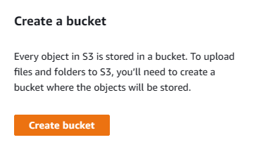

# Importing existing infrastructure into the terraform configuration

Terraform is an IAC tool that helps us manage our infrastructure by building, changing, and versioning infrastructure. When we create infrastructure with Terraform, we define our desired state in code. Then Terraform  creates, modifies, or deletes the resources as needed to match that desired state. 

What if we have infrastructure that we already created without using terraform but we want to manage with Terraform. In such cases, we can use the Terraform import command to import those resources into our Terraform state.

In this hands-on guide, we'll take a look at how to use the Terraform import command with examples using S3 buckets.

# What is Terraform Import Command?

The Terraform import command allows you to import existing infrastructure resources into your Terraform state. 

When you import an existing resource, Terraform will create a new state resource for that resource, based on the current state of the resource in the provider. Terraform will then update that state resource to match the desired state defined in your configuration.

Let's see how terraform import works in action.

# Prerequisites

1. You need to have Terraform installed on your system. If you do not have terraform, just go to terraform download page and follow the instructions to download and install terraform.


2. I will perform terraform commands to create AWS S3 buckets. You should need an AWS account if you want to follow along with the examples.

# Importing an S3 Bucket

1. Let's go to AWS Console and head to S3 service anc clikc on create a bucket.


2. Provide a unique name, choose a region and leave the rest to defaults. Then click on create bucket


3. You will see the green pop up with "Successfully created bucket 'your bucket name'"

4. Now head back to your local terminal. Create a new folder to work and cd into that folder

```bash
 mkdir terraform-import-dir && cd terraform-import-dir
 ```
5. Create a new Terraform configuration file for the S3 bucket resource. 

```bash
vi main.tf
```
6. Enter the following code

```HCL
resource "aws_s3_bucket" "my_bucket" {
  bucket = "mehmet-terraform-bucket" # Enter your bucket name here
}
```
7. Run terraform init to initialize the configuration.


8. Run the following command to import the S3 bucket:

```bash
terraform import aws_s3_bucket.my_bucket mehmet-terraform-bucket

```
This command tells Terraform to import the existing S3 bucket with the name mehmet-terraform-bucket and create a new Terraform state resource for it named aws_s3_bucket.my_bucket.


9. Verify that the import was successful by running terraform plan. Terraform should show that there are no changes to be made to the S3 bucket resource.


Great. Now, we have imported our S3 bucket into our terraform code.  Note that before running the import command, we need to create a resource blcok for it so it actually requires some work beforehand. However, it is a way to bring the existing infrastructure in to terraform.

# Multiple S3 buckets

What if we have multiple resources, such as multiple s3 buckets. How can we import them?

If you have multiple S3 buckets that you want to import using the Terraform import command, you can follow the same process as we did above.

Let's imagine that we have 10 s3 buckets. What we can do is to define the S3 resource block in our Terraform configuration file once, and then use a for_each argument to create multiple instances of the same resource.

1. Define a map variable that contains the names of each bucket

```HCL
variable "bucket_names" {
  type = map(string)
  default = {
    bucket1 = "my-bucket1"
    bucket2 = "my-bucket2"
    bucket3 = "my-bucket3"
    ...
    bucket10 = "my-bucket10"
  }
}

  ```
2. Use the for_each argument to create an S3 bucket resource for each bucket in the map.

```HCL
resource "aws_s3_bucket" "buckets" {
  for_each = var.bucket_names
  
  bucket = each.value
  
}

  ```

3. Run terraform import command for each bucket

```bash
terraform import aws_s3_bucket.bucket[0] my-bucket1
terraform import aws_s3_bucket.bucket[1] my-bucket2
terraform import aws_s3_bucket.bucket[2] my-bucket3
...
terraform import aws_s3_bucket.bucket[9] my-bucket10
```

4. You can also use the for_each meta-argument with the terraform import command to import all the buckets at once.

```bash
for bucket_name, bucket_value in var.bucket_names:
  terraform import aws_s3_bucket.bucket[bucket_name] ${bucket_value}
```

This will loop through all the bucket names and values in the bucket_names variable and import them into Terraform using a single command.


Note: Do not forget to destroy s3 bucket with terraform destroy command (Since we imported it, you do not need to go to AWS console to manually delete it)

Follow me on twitter to get notified about future posts: @mehmetodabashi