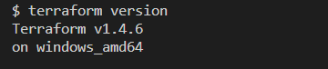

# Terraform
Terraform is an open-source infrastructure as code tool for building, changing, and versioning infrastructure. It allows you to define and provision infrastructure resources, such as virtual machines, storage accounts, and networks using a declarative syntax. This means you define the desired state of your infrastructure in code, and Terraform will apply the necessary changes to reach that state.

With Terraform, you can manage infrastructure across multiple cloud providers (e.g. AWS, Azure, GCP), as well as on-premises infrastructure, using the same workflow and tools. Terraform enables you to automate the process of provisioning infrastructure resources, making it faster, more efficient, and less prone to errors.

# Variables in Terraform

Variables in Terraform are placeholders for values that can be used throughout your Terraform configuration files. They are a way to parameterize your infrastructure code and make it more flexible and reusable.

There are a number of ways in which you can define and use variables in Terraform. In the next section, we will explore those methods by following a hands-on approach. We will create an AWS S3 bucket for each method by using terraform variables. Furthermore, I will explain the precedence of variables in Terraform. This is important because we may have defined multiple values for the same variables using different methods. In such cases, Terraform applies the value of the variable that has the highest precedence over the other variable types.

# Prerequisites

1. We will perform Terraform operation so you need to have Terraform installed on your system. If you do  not have terraform, just go to https://developer.hashicorp.com/terraform/downloads and follow the instructions to download and install terraform.



2. I will perform terraform commands to create AWS S3 buckets. This is not a must as you can provision other types of infrastructure on different cloud providers or simply create files using local provider. However, you should need an AWS account if you want to actually follow along with the examples.


# Variable methods

## Using resource blocks

The most basic method is to define a variable and then use it directly in a resource block. To demonstrate this, let's create a main.tf file.

1. Enter `vi main.tf`

2. Before writing the variable resource block, let's enter provider information. We will create AWS S3 buckets, so we need to make use of AWS plugin.

3. Go to registry.terraform.io and click on Browse providers


4. From the list, tap on AWS

5. On the AWS page, click on `Use Provider`on the right. 


6. Then simply copy the code and paste it into your main.tf file


Note: If you have not configured your AWS credentials for your local machine, you should also add the following code to your main.tf as well. If you have configured them before, just ignore the code below and skip to step 7.

```hcl
provider "aws" {
  # Configuration options including credentials
}
```

7. Now enter the following code to create an S3 bucket (Make sure to change the default value for the bucket and enter a unique bucket name as S3 requires unique names for buckets).

```hcl
variable "bucket_name" {
  type    = string
  default = "mehmet-first-bucket"
}

resource "aws_s3_bucket" "example" {
  bucket = var.bucket_name
  acl    = "private"
  # ...
}
```

8. Run `terraform init` to initialize backend


9. Now, run `terraform apply` to create the S3 bucket with the default name provided in the variable resource block.


10. Let's check the resource with `terraform show` command


Good job! We have created a new bucket by using a variable block.

## Using seperate variables.tf

This file is actually the same as adding a variable block in the main.tf file. You just need to remove the variable blcok in the main.tf file and create a variables.tf file with the same block

So the variables.tf file will have the following content


Note: If you have a variables.tf file and the variable block in the main.tf file for the same variable, then you will get a duplicate variable error. Therefore just keep one of them.

Let's run `terraform apply`


 
Let's run `terraform show" command


As you can see, the bucket name changed to mehmet-scond-bucket because we created a new variables.tf file and defined a new name there.

## Using a terraform.tfvars file

Terraform uses a variable definition file in order to offer more options in using variables. Consider that you are working in a company that has different teams, such as development and production. While, the variables.tf file offer default variable values for everyone, each team may want to proceed with variables specific to their teams without altering the default variable values in the variables.tf file.

Let's see in an example

1. We still have the variables.tf file as below


2. Now, create a terraform.tfvars file with only the following code. terraform.tfvars file uses key value pairs.

```hcl
bucket_name = "mehmet-third-bucket"
```
3. Keep the main.tf file unchanged with the same resource blocks.

```hcl
resource "aws_s3_bucket" "example" {
  bucket = var.bucket_name
  }
```

4. Now, let's run `terraform apply`command.


5. Let's run `terraform show` command


As you can see, terraform deleted mehmet-second bucket and created mehmet-third bucket. Because, terraform.tfvars file has precedence over variables.tf file

## Using an *.auto.tfvars file

We can further use of variables with an auto.tfvars file. This file also uses the same format as the terraform.tfvars file. You can provide any name with the suffix .auto.tfvars

1. Keep the variables.tf and terraform.tfvars without any modification.

2. Create a auto.tfvars file with the following contents. I will name my file `mehmet.auto.tfvars`

```hcl
bucket_name = "mehmet-forth-bucket"
```
3. Run `terraform apply`


4. Let's run `terraform show` command


As you see, terraform deleted mehmet-third bucket and created mehmet-fourt bucket. Because *.auto.tfvars has precedence over both terraform.tfvars and variables.tf files.

## Using environment variables

You can use environment variables to define values for your configuration. One thing to note is that environment variables are prefixed with TF_VAR_. For example, to set the value of a variable named my_var, you would set the environment variable TF_VAR_my_var.

1. Keep variables.tf, terraform.tfvars, and *.auto.tfvars files intact.

2. Export bucket name as environment variable by running the following code in your terminal

```bash
export TF_VAR_bucket_name="mehmet-fifth-bucket"
```
3. Run `terraform apply`


As you see, nothing has changed. Because environment variables have the  the least precedence. If you have other types of variables, they will not be used.

## Using any -var and -var-file options on the command line

Variables set through command-line flags have the highest precedence. 

1. Let's run the `terraform apply`command with a command line -var flag for the bucket name. Keep all the previous files intact.

```bash
terraform apply -var "bucket_name=mehmet-sixth-bucket"
```


2. Run `terraform show` to see the resource name


Now, we have a bucket named mehmet-sixth-bucket. Terraform destroyed the mehmet-fifth-bucket and created this one because command line options have the highest precedence.

# The Order of Precendece

The order of precedence for variable sources is asfollows with later sources taking precedence over earlier ones::

1. Environment variables
2. The terraform.tfvars file, if present.
3. The terraform.tfvars.json file, if present.
4. Any *.auto.tfvars or *.auto.tfvars.json files, processed in lexical order of their filenames.
5. Any -var and -var-file options on the command line, in the order they are provided.

We have created all types of variables and used a hands-on approach to see which ones took precedence. I hope this guide helped you understand the use of variables in terraform and how they take precedence over others.